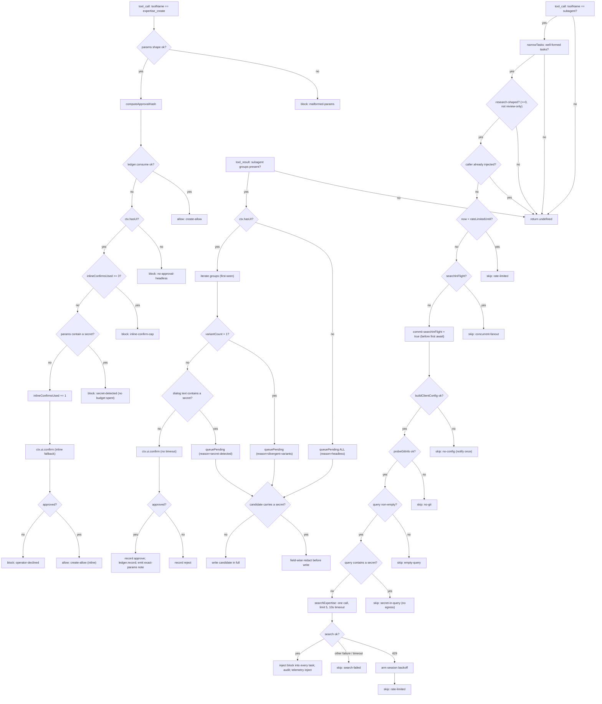
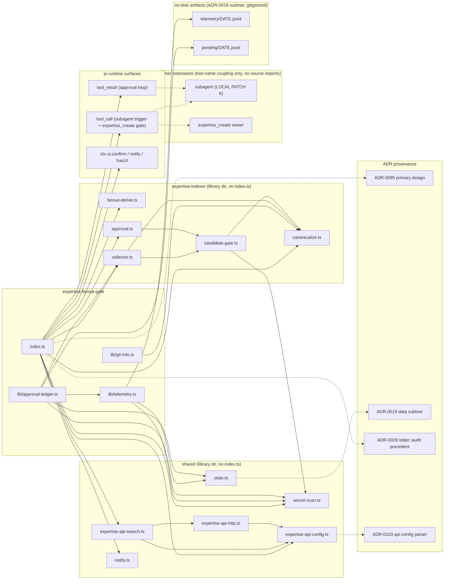

# expertise-fanout-gate — deterministic canonical-expertise pre-fetch

Pi extension that makes the canonical-expertise pipeline's "research starts →
expertise is searched" rule ([`agent/rules/expertise-canonical-fanout.md`](../../rules/expertise-canonical-fanout.md))
a **runtime property** instead of orchestrator prompt discipline
([ADR-0095](../../../adrs/0095-deterministic-expertise-fanout-gate.md), #613, epic #595).

## What it does

A `tool_call` hook on the `subagent` tool:

1. **Trigger** (mechanical, no LLM judgment — `expertise-indexer/fanout-derive.ts`):
   parallel mode (`tasks`), `tasks.length >= 3`, and NOT review-only (the
   closed set `checkmarx-expert` / `code-review-expert` / `linter` /
   `security-review-expert` — a fanout composed entirely of those is the
   multi-reviewer `/review` shape, not research). Single-agent and chain
   calls never trigger (accepted gap, ADR-0095). A fanout where the caller
   already supplied any `expertiseInjection` stands down entirely.
2. **Derive**: canonical query from the agent names + first task
   (`buildCanonicalQuery` template), and the anchoring `canonical_blob_sha`
   from repo origin + HEAD + the exact task list (`computeCanonicalBlob`,
   empty `files` by contract — a live fanout has no changed-set).
3. **Search**: ONE `expertise_search` (limit 5, bounded by a 10 s timeout)
   through the shared client stack (`shared/expertise-api-{config,http,search}.ts`).
   It consumes either the retained loopback/API-key profile or upstream's HTTPS
   bearer / static-OIDC contract (`EXPERTISE_API_*`). Current response-hygiene
   `{ value, ... }` wrappers for title/body are projected explicitly.
4. **Inject**: renders `CANONICAL_EXPERTISE_RESULTS` via
   `renderCanonicalResultsBlock` and mutates every task's
   `expertiseInjection` in place. The vendored subagent extension prepends it
   to each child's user-role `Task:` framing (LOCAL PATCH 6) — never
   `--append-system-prompt`, per [`no-mcp-servers.md`](../../rules/no-mcp-servers.md).

## Architecture at a glance

The three hooks and the actors they mediate — the pre-fetch injection, the
approval loop, and the create gate — in one pass:

```mermaid
sequenceDiagram
    participant Orch as Orchestrator model
    participant Pi as pi runtime
    participant Gate as expertise-fanout-gate
    participant Sub as subagent ext (LOCAL PATCH 6)
    participant API as expertise-search API
    participant Op as Operator (ctx.ui)

    Orch->>Pi: subagent tool_call (parallel tasks)
    Pi->>Gate: tool_call event (toolName=subagent)
    Gate->>Gate: narrowTasks + isResearchShapedFanout + hasCallerInjection
    alt research-shaped, no caller injection, not rate-limited, no search in flight
        Gate->>Gate: scan query for secrets before egress
        Gate->>API: GET /expertise/search/semantic (q, limit=5, 10s timeout)
        API-->>Gate: results (or 429 Retry-After)
        Gate->>Gate: mutate every task.expertiseInjection
        Gate--)Pi: stderr audit line (+ ctx.ui.notify when interactive)
        Gate--)Gate: telemetry event=inject
    else any precondition fails
        Gate--)Gate: telemetry event=skip/error; fanout proceeds uninjected
    end
    Pi->>Sub: execute subagent (tasks carry expertiseInjection)
    Sub-->>Pi: tool_result (details.expertiseCandidates attached)
    Pi->>Gate: tool_result event (toolName=subagent)
    alt interactive (ctx.hasUI)
        loop each coalesced group (first-seen)
            Gate->>Op: ctx.ui.confirm (no timeout)
            Op-->>Gate: approve / decline
            Gate->>Gate: on approve, record single-use ledger hash
        end
        Gate-->>Pi: guidance note naming the exact create params
    else headless
        Gate->>Gate: queuePending (redacted iff a secret is present)
        Gate-->>Pi: queued note (needs an interactive session)
    end
    Orch->>Pi: expertise_create tool_call (approved fields)
    Pi->>Gate: tool_call event (toolName=expertise_create)
    Gate->>Gate: computeApprovalHash + ledger.consume
    alt hash matches a recorded approval
        Gate-->>Pi: allow
    else no match / malformed / gate error
        Gate-->>Pi: block (fail-closed)
    end
```

## Decision flow

Every gate, ladder, and veto across the three hooks. Note the two directional
failure postures: the pre-fetch (top) is **fail-open** — any precondition miss
skips and the fanout proceeds uninjected — while the create gate (bottom) is
**fail-closed** — anything short of a recorded approval blocks.



## Approval loop + `expertise_create` gate (#605)

A `tool_result` hook on `subagent` surfaces coalesced
`EXPERTISE_CANDIDATES` groups (attached by LOCAL PATCH 6) to the operator
**one at a time via `ctx.ui.confirm`** — no dialog timeout (RPC
auto-resolve hazard), first-seen order. A real confirm(true) records a
**full-field approval hash** (`expertise-indexer/approval.ts`: the
create-relevant subset, byte-locked serialization — never the
`{domain,title}` coalesce fingerprint) in an in-session, single-use
ledger, and appends a guidance note to the tool result with the EXACT
params the model must pass to `expertise_create`.

A `tool_call` gate on `expertise_create` recomputes the hash over the
actual call params: ledger match → allow (consumed); anything else →
**block, fail-closed** — including internal gate errors. Interactive
sessions get an inline fallback: a direct create with no prior fanout
approval triggers its own `ctx.ui.confirm` over the exact params (secret-
scanned before display), **capped at 3 per session** (approval-fatigue
guard — a looping model cannot spam dialogs until one gets a reflexive
yes). A budget slot is spent only when a dialog is actually shown — a
secret-shaped attempt is blocked before the dialog and does not consume
one. Headless sessions never approve: candidate groups queue to
`~/.pi/agent/extensions/expertise-fanout-gate/pending/<date>.jsonl`, and
creates without a ledger match are blocked outright.

Divergent-variant groups (`variantCount > 1`) are queued, never approved
blind — the library retains only the representative body, so the
per-proposer inspection invariant (`bodyHashesByProposer`) cannot be
satisfied in a single dialog.

## Failure posture

**Fail-open, self-caught.** The pi runtime does not wrap `tool_call`
handlers in try/catch, so every failure path (missing credential, unreachable API,
429, git probe failure, internal bug) is caught inside the handler and
degrades to "fanout proceeds without canonical context". The one search is
bounded by a 10 s timeout so a hung endpoint cannot stall the turn (it
degrades to a `search-failed` skip). One search per fanout; the in-flight
budget is committed before the first `await` so overlapping fanouts cannot
double-spend it; a 429 arms a session-wide backoff (`Retry-After` when sent,
else 60 s); no in-handler retries.

## Visibility & telemetry

Each automatic search — precisely because it is not a model-visible tool
call — emits one audit line (stderr always, `ctx.ui.notify` when
interactive) and a JSONL record under
`~/.pi/agent/extensions/expertise-fanout-gate/telemetry/<YYYY-MM-DD>.jsonl`
(ADR-0019 data subtree; local-only, gitignored). The telemetry log is the
first-party artifact the #601
audit consumes: approval-loop rows carry the candidate's `candidateBlobSha`,
which the audit cross-checks against an earlier `inject` row's anchor in the
same file — a forged or displaced anchor fails the audit. The sibling
`pending/<YYYY-MM-DD>.jsonl` (also gitignored) holds candidate groups queued
for later interactive approval. Secret handling on both files is described in
the next section.

## Configuration

Same sources and profile selection as expertise-client, resolved through the
shared parser. The upstream profile reads process env then
`~/.config/expertise-api/secrets.env` (or `EXPERTISE_API_SECRETS_FILE`) and
accepts exactly one literal `EXPERTISE_API_TOKEN` or absolute
`EXPERTISE_API_TOKEN_FILE`; mounted files are re-read for each search. The
legacy profile reads process env then the client `.env.local`; the gate checks
both the source-tree sibling and the git-package install locations, fixing the
packaged layout where no sibling client directory exists. When both `.env.local`
copies are present they are **merged installed-then-source, so the source-tree
copy wins** on any overlapping key. No config → one warning per session and a
fail-open skip. Read-only by construction.

## Trust & security boundary

Config comes only from `process.env` plus fixed operator-owned files (the
legacy expertise-client `.env.local` and upstream
`~/.config/expertise-api/secrets.env`); the shared parser keeps legacy API
keys loopback-only and requires HTTPS for non-loopback bearer endpoints.
Mounted-token paths must be absolute, bounded, and operator-configured; shell
substitution in env files is never evaluated. The bearer value and its file
pointer remain parent-owned and are stripped from spawned children. Project or
repository content can never steer the endpoint, and the extension imports no
create-capable module — the only write path is the fail-closed
`expertise_create` gate.

Every model-controlled free-text surface is scanned with the shared secret
pattern set before it can leave the process or reach durable storage:

- the **outbound search query** (built from `tasks[].agent` / `tasks[0].task`)
  is scanned before the request fires — a hit skips the search
  (`secret-in-query`) rather than sending a `?q=` parameter to the endpoint;
- **telemetry** free-text fields are scanned on the full value *before* any
  length bound (truncating first could drop enough of a boundary-straddling
  secret to evade the scan), then redacted to category names on a match;
- **pending-queue** candidates are written in full for later review, but
  field-wise redacted whenever any field carries secret-shaped content — on
  every queue path (headless, divergent-variant, and interactive
  secret-detected), not only the last;
- the **approval dialog** text and the **inline create** params are scanned
  before display.

## Dependencies

Module, on-disk-artifact, and ADR-provenance graph. Cross-extension coupling is
**tool-name only** (dashed) — the two allowed source-import targets are the
index-less library dirs `shared/` and `expertise-indexer/` (ADR-0065/0088/0095).



## Files

- `index.ts` — hook wiring, config resolution, backoff, injection, approval
  loop, create gate.
- `lib/git-info.ts` — bounded `git` probes (origin, HEAD), injectable executor.
- `lib/telemetry.ts` — JSONL appender + secret-redaction.
- `lib/approval-ledger.ts` — in-session single-use ledger + pending queue.
- `test/index.test.ts` — fake-pi harness tests (trigger boundaries, round-trip
  sha, every fail-open path, 429 backoff, search timeout, git-probe TOCTOU,
  outer-catch telemetry, query secret-scan, env-merge precedence).
- `test/approval.test.ts` — approval loop + create gate (ledger single-use,
  TOCTOU, headless fail-closed, divergent-variant queueing, inline confirm,
  pending-queue redaction scope).

Run tests: `./scripts/test-expertise-fanout-gate.sh` (wired into
`validate.sh`).

## Distribution

Config-mirror-shipped (like `subagent` and `expertise-indexer`; NOT a
standalone mirror) — its imports of `../expertise-indexer/…` and
`../shared/…` resolve on a distributed install because all three ship
together in the pi-config mirror.
