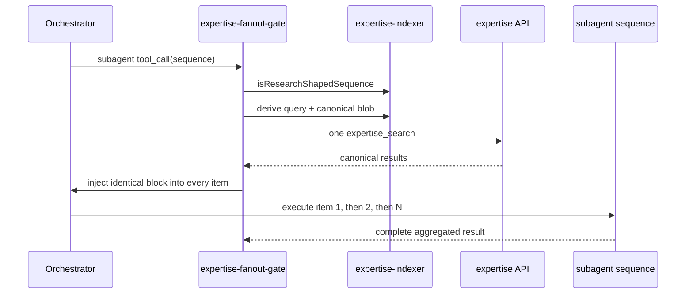

# expertise-fanout-gate

> Historical component name retained for installation, telemetry, and mirror compatibility. Since ADR-0148 the gate operates on serial subagent sequences, not concurrent fanout.

Deterministically adds canonical expertise to research-shaped `subagent.sequence` calls and enforces human approval for `expertise_create`.

## Trigger

The `tool_call` hook runs only when:

- `toolName === "subagent"`;
- `sequence` is a well-formed non-empty array;
- `sequence.length >= 3`;
- at least one item is not a review-only agent; and
- no caller-supplied sequence injection needs normalization.

Single and dependent chain calls do not trigger automatically. Review-only sequences (`code-review-expert`, `security-review-expert`, `linter`, `checkmarx-expert`) intentionally stand down.

## Serial Injection Flow



The gate mutates every sequence item with the same `CANONICAL_EXPERTISE_RESULTS` block. If the caller already supplied any non-empty block, the first one is normalized across all items and automatic search stands down. The subagent extension prepends it to user-role `Task:` content. It never becomes a system prompt. Identical injection is required for independent serial consensus replicas.

## Failure Posture

Pre-fetch is fail-open and fully self-caught because pi does not catch `tool_call` hook exceptions. Missing credentials, git-probe failure, network errors, malformed response data, timeout, or 429 lets the sequence continue uninjected. A 429 arms session backoff; overlapping tool calls share a one-search-in-flight guard.

The query is secret-scanned before egress. Telemetry is secret-redacted and records inject, skip, and error outcomes under the existing `expertise-fanout-gate` namespace.

## Candidate Approval

The `tool_result` hook reads coalesced `SubagentDetails.expertiseCandidates` after the full sequence. Interactive sessions present groups one at a time. A real `ctx.ui.confirm(true)` records a single-use hash over all create-relevant fields. Headless sessions queue candidates and approve nothing.

The `expertise_create` tool-call gate is fail-closed: only an exact recorded hash is allowed, then consumed. Model-authored approval prose has no authority. The inline confirmation fallback remains session-capped to limit approval fatigue.

## Authentication Boundary

The parent consumes either loopback `PI_EXPERTISE_*` API-key configuration or HTTPS `EXPERTISE_API_*` bearer/static-OIDC configuration. Child environment sanitization removes bearer sources and default secrets-file discovery. Project content cannot choose the endpoint.

## Implementation

- `index.ts` — trigger, pre-fetch, injection, telemetry, approval and create gate
- `lib/approval-ledger.ts` — single-use approvals and pending queue
- `lib/git-info.ts` — bounded repository identity probe
- `lib/telemetry.ts` — local secret-redacted JSONL
- `../expertise-indexer/sequence-derive.ts` — pure serial trigger/query/blob derivation
- `../expertise-indexer/collector.ts` — rendering, parsing, and candidate coalescing

## Validation

```sh
./scripts/test-expertise-indexer.sh
./scripts/test-expertise-fanout-gate.sh
./scripts/typecheck-extensions.sh
./scripts/lint-extensions.sh
```

`./scripts/validate.sh` runs the required suites and expertise audit.

## Architecture

ADR-0095 remains authoritative for deterministic search, approval binding, and authentication boundaries. ADR-0148 supersedes its parallel-task trigger with ordered serial-sequence derivation. Tracking issue: #1055.
