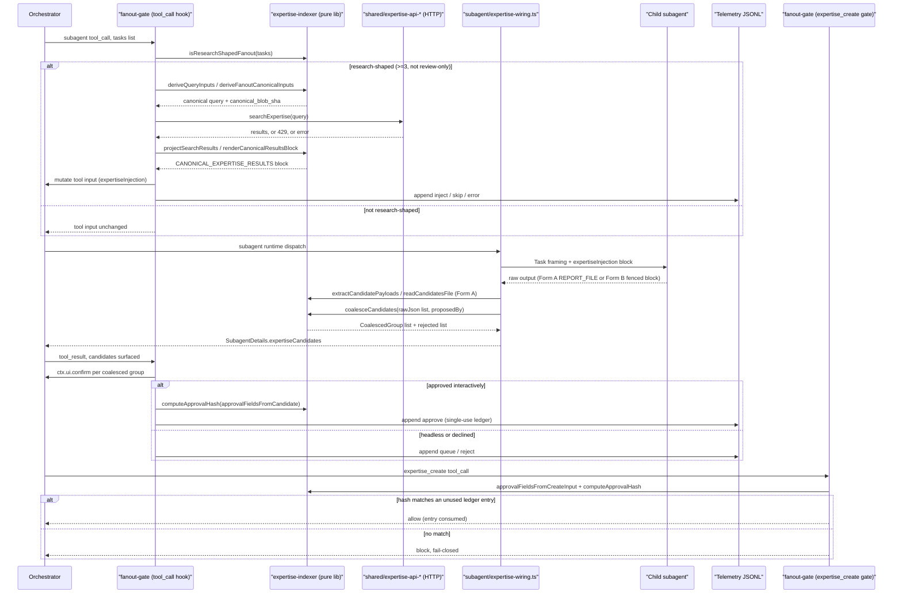
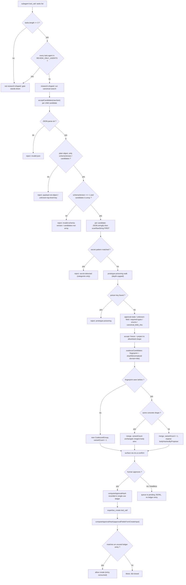
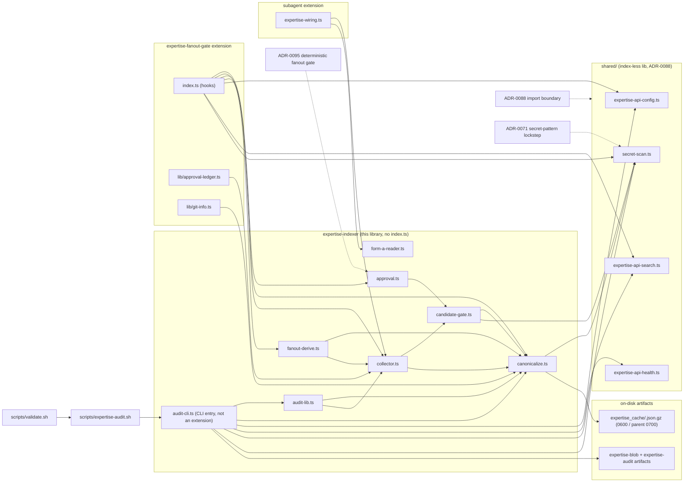

# expertise-indexer

Pure-library extension providing the deterministic **canonicalizer** used by every stage of the expertise-consumption pipeline (pi_config epic #595).

- **Source rule:** [`agent/rules/expertise-canonical-fanout.md`](../../rules/expertise-canonical-fanout.md) (the rule #603 originally scoped as `expertise-consumption.md` shipped under this name)
- **Tracking:** #598 — canonicalizer + cache & manifest, epic #595

This extension does not register any pi tool. It holds the pure library modules imported by the `expertise-fanout-gate` extension (ADR-0095), the vendored subagent's expertise wiring (#611), the candidate-gate (#608), and the CI expertise-audit stage (#601) — plus `audit-cli.ts`, the audit's tsx-invoked runner (not an extension entry point).

## Overview

Where these primitives sit in the canonical-expertise pipeline — the pre-fetch injection, the candidate return path, the approval loop, and the create gate:



## Public API

### `computeCanonicalBlob(inputs) → { sha, blob }`

Deterministic serializer + SHA-256 digest. **Pure — no I/O.**

Inputs (fixed order, all normalized before hashing):

| Field | Type | Notes |
|---|---|---|
| `repoOrigin` | string | git `origin` remote URL |
| `headSha` | string | 40-char (SHA-1) or 64-char (SHA-256) lowercase hex |
| `files` | `{path, blobSha}[]` | sorted lexicographically by `path` internally; duplicates rejected |
| `taskString` | string | orchestrator brief / query text |
| `agentFrontmatter` | `Record<string, FrontmatterValue>` | scalars or scalar arrays; keys sorted internally |

Normalization:

- Strings: **NFKC** (Unicode canonical equivalence) + LF-only newlines + per-line trailing-whitespace strip.
- Object keys: lexicographic sort at every level.
- Numbers: `NaN`/`Infinity` rejected.

Serialization: **manual recursive sorted-key serializer**, not `JSON.stringify(x, sortedKeys)`. Locked byte-shape asserted by a golden fixture test; any change to the shape is semver-breaking and must bump `schemaVersion` (currently `1`).

### `writeCanonicalBlob(sha, blob, opts?) → { path, uncompressedBytes, compressedBytes }`

Persists the serialized JSON, gzip-encoded, at `${PI_CODING_AGENT_DIR:-$HOME/.pi}/expertise_cache/<sha>.json.gz`.

Invariants:

| Guarantee | Mechanism |
|---|---|
| Fail closed on credential match | `scanRawString` (from `expertise-client/lib/secret-scan.ts`) runs against the raw JSON **before any file open**. On match, throws `CanonicalBlobSecretError` — no file created, no cache polluted. Error message carries category names only (never the matched substring). |
| Parent dir 0700, file 0600 | `mkdirSync(..., mode: 0o700)`; final `chmodSync(..., 0o600)`; temp file created with `O_EXCL` + mode 0600 |
| No partial writes | Temp sibling + `fsync` + atomic `rename` |
| No symlink follow at leaf | `O_EXCL` on the temp path; `realpath` check on the resolved parent dir |
| Idempotent on re-write of same sha | Same content by construction; still atomic |

### `resolveCacheDir() → string`

Returns the cache directory path. Honors `PI_CODING_AGENT_DIR` when set and non-blank; otherwise falls back to `$HOME/.pi/expertise_cache/`.

### `normalizeText(s) → string` / `isValidGitSha(s) → boolean`

Exported normalization + validation helpers, reusable by consumers that need the same normalization for other inputs.

### `acceptCandidates(rawJson) → { accepted, rejected }` (#608)

Orchestrator-side gate that ingests the `EXPERTISE_CANDIDATES` transport payload emitted by subagents (contract in #600) and produces a strictly-projected, secret-scanned batch that is safe to surface to a human for approval.

**Pure — no I/O.** Consumed by the orchestrator collector (#599), the CI expertise-audit (#601), and the pre-push hook (#604).

Ordered checks (all fail-closed):

1. `JSON.parse` (Node 18+ safe against prototype pollution at parse time).
2. Payload must be a plain object with exactly `{schemaVersion, candidates}`; `schemaVersion === 1`.
3. Secret scan via `scanRawString` on the raw candidate serialization — **runs FIRST** as a universal fail-closed gate, before any other per-candidate check, so no downstream rejection hint can echo a secret (catches secrets hidden in soon-to-be-dropped unknown fields, closing the terminal-scrollback leak vector). Category names only in the hint — never the matched substring. `candidate-gate.ts` carries an explicit "reordering ANY check above this line reopens a rejection-surface leak class — do not" warning above it.
4. Prototype-poisoning walk on the parsed candidate subtree (own-property `__proto__` / `constructor` / `prototype` at any depth in objects and arrays). Does **not** recurse into strings — a body legitimately discussing `__proto__` is fine.
5. Approval-state field rejection (`approved`, `approvedBy`, `approvalTimestamp`, `approvalToken`) with the specific `approval-state-field` signal, not silent stripping.
6. Unknown-field rejection with the offending key name.
7. Field validation: required strings, optional string types, `entryType` / `severity` enums, `Info` severity requires non-blank `justification`, `canonical_blob_sha` shape (40 or 64-char lowercase hex).
8. Projection to a frozen, prototype-less (`Object.create(null)`) object with only the allowlisted fields.

Rejection reasons are stable string codes (`RejectionReason` union type) safe to assert against in CI. The `hint` field carries structured context (field name, offending key, secret categories) never a leaked secret substring. A well-typed-but-malformed `canonical_blob_sha` rejects with its own `invalid-canonical-blob-sha` reason (distinct from a `wrong-type` field mismatch).

`ProjectedCandidate` — the frozen, allowlisted output shape (anything else is dropped `unknown-field` or rejected):

| Field | Type | Required | Notes |
|---|---|---|---|
| `domain` | string | yes | |
| `title` | string | yes | |
| `body` | string | yes | |
| `entryType` | enum | yes | `IssueFix` / `Caveat` / `Requirement` / `Pattern` |
| `severity` | enum | yes | `Info` / `Warning` / `Critical` |
| `justification` | string | no | non-blank REQUIRED when `severity === "Info"`; a review field, never sent to the server |
| `tags` | string[] | no | |
| `source` | string | no | |
| `sourceVersion` | string | no | |
| `proposedBy` | string | yes | |
| `dedupeQuery` | string | yes | |
| `canonical_blob_sha` | string | yes | 40- or 64-char lowercase hex |

### Collector primitives (#599)

Orchestrator-side building blocks for the canonical-fanout methodology described in [`agent/rules/expertise-canonical-fanout.md`](../../rules/expertise-canonical-fanout.md). **Pure — no I/O, no tool invocations.** Consumed today by the orchestrator model's prompt-driven flow; will additionally be consumed by the subagent runtime wiring (#611), CI expertise-audit (#601), and pre-push hook (#604).

| Export | Contract |
|---|---|
| `buildCanonicalQuery(inputs)` | Structured inputs `{domain, technology, taskType, goalOrSymptom}` → canonical query string: NFKC + lowercase + punctuation/URL/emoji strip + whitespace collapse + adjacent-token dedupe + `MAX_CANONICAL_QUERY_TOKENS` (12) clamp. Returns `""` when all inputs normalize to empty (caller skips search). Deterministic. |
| `renderCanonicalResultsBlock(results, canonicalBlobSha)` | Byte-locked fenced-block string ready to prepend to a subagent brief. Format: `<!-- BEGIN CANONICAL_EXPERTISE_RESULTS canonical_blob_sha=<sha> schemaVersion=1 -->\n{JSON}\n<!-- END CANONICAL_EXPERTISE_RESULTS -->`. Caps: per-body `MAX_INJECTED_BODY_BYTES` (4 KB, UTF-8-boundary-safe cut, suffix reserved so rendered body fits within the cap); overall `MAX_INJECTION_BLOCK_BYTES` (24 KB, tail-truncated result-by-result with `truncated: true` flag). End-marker-collision defense: any `-->` in the stringified JSON payload is substituted with `--\u003e` so a body legitimately containing the END marker does not corrupt parse. Throws on invalid `canonicalBlobSha`. |
| `parseCanonicalResultsBlock(input)` | Round-trip parser. Returns `null` when no valid block present; throws `TypeError` (uniform error contract; `SyntaxError` from `JSON.parse` is rewrapped with `cause`) on any structural failure inside the block. Used by CI audit. |
| `extractCandidatePayloads(childOutput)` | Extracts `EXPERTISE_CANDIDATES` transport payloads from a subagent's raw output blob per #600. Form B: fenced-block `rawJson` (caller feeds to `acceptCandidates`). Form A: validated `reportFile` path against the strict allowlist `^/tmp/subagent-expertise-[a-z0-9-]+-\d+\.candidates\.json$` (no `..`, no double-slash, no NUL, no non-ASCII). Duplicate Form A paths collapse at extraction. Multiple blocks per output supported; malformed blocks silently skipped (fail-open at extraction; fail-closed at ingestion). |
| `coalesceCandidates(inputs)` | Gates each `{rawJson, proposedBy}` through `acceptCandidates`, then fingerprints accepted candidates by SHA-256 of the normalized `{domain, title}` pair (NFKC + lowercase + whitespace-collapsed). Identical fingerprints merge into one `CoalescedGroup` with `proposalCount`, order-independent `variantCount` (distinct concrete-shape count computed via a `Set`), sorted-deduplicated `proposedByList`, and — when `variantCount > 1` — a frozen prototype-less `bodyHashesByProposer` map so the approval UI can enforce per-proposer body inspection (defense against body-smuggling under merged provenance). Representative selection: longest-body wins; deterministic on tie. Group order: stable by first-seen fingerprint. Rejections carry `proposedBy` forward. `proposedByList` and `bodyHashesByProposer` are both sourced from the ORCHESTRATOR-supplied `CoalesceInput.proposedBy` (never the untrusted `candidate.proposedBy` field) so attribution cannot be forged by a subagent. |

### Fanout derivation (`fanout-derive.ts`, #613 / ADR-0095)

Pure derivation shared by the runtime trigger ([`expertise-fanout-gate/`](../expertise-fanout-gate/README.md)) and the CI audit (#601): given the exact `subagent` tool-call params, decide whether the fanout is research-shaped and derive the canonical query + blob inputs. **Determinism contract:** pure functions of the arguments only — no clock, I/O, env, or randomness — so the audit can recompute the expected `canonical_blob_sha` from the telemetry-recorded task list plus its own git state.

| Export | Contract |
|---|---|
| `isResearchShapedFanout(tasks)` | Mechanical trigger: `tasks.length >= RESEARCH_FANOUT_MIN` (3, mirroring the divergence minimum in `research-parallelism.md`) AND not review-only. `REVIEW_ONLY_AGENTS` is the closed set `checkmarx-expert`/`code-review-expert`/`linter`/`security-review-expert` — a fanout composed entirely of those is the multi-reviewer `/review` shape, not research. |
| `deriveQueryInputs(tasks)` | `{domain: sorted de-duplicated agent names, taskType: "research", goalOrSymptom: first task string}` — feeds `buildCanonicalQuery` unchanged. |
| `deriveFanoutTaskString(tasks)` / `deriveFanoutCanonicalInputs(args)` | Canonical blob inputs for a live fanout: `<agent>: <task>` lines in caller order; `files` EMPTY by contract (a live fanout has no changed-set — the anchor is repo@HEAD + the exact task list); empty frontmatter. |
| `projectSearchResults(text)` | Tolerant projection of the semantic endpoint's `{"results":[…]}` (or bare-array) body into `CanonicalResultEntry[]`; schema drift degrades to fewer results, never a throw into the (runtime-uncaught) `tool_call` hook. |

### Approval binding (`approval.ts`, #605 / ADR-0095)

The lever behind "the orchestrator writes it with approval": `computeApprovalHash(fields)` — SHA-256 over a byte-locked, fixed-key-order serialization of the CREATE-relevant field subset (domain/title/body/entryType/severity + optional source/tags/sourceVersion; tag order significant). A real `ctx.ui.confirm` approval records it in the gate's in-session ledger; the `expertise_create` tool-call gate recomputes it over the actual call params and blocks on anything but an exact single-use match. Deliberately NOT the `{domain,title}` coalesce fingerprint (body-smuggling vector), and deliberately excluding `justification` (a review field, not a create param — displayed at approval, never sent to the server). `approvalFieldsFromCandidate` / `approvalFieldsFromCreateInput` are the two projections; the round trip is test-pinned.

### Hardened Form A reader (`form-a-reader.ts`, #600 / ADR-0095)

`readCandidatesFile(path)` closes the deferred `REPORT_FILE:` read: O_NOFOLLOW open, `fstat` on the opened fd (regular file, ≤512 KB, own uid, mode exactly 0600 — children MUST create candidate files with 0600), canonical-parent == canonical `/tmp` (realpath both sides — macOS `/tmp` is a symlink). Structured `{ok:false, reason}` failures with stable codes; consumed by `subagent/expertise-wiring.ts`, which warns and drops on any violation.

**Platform note:** the ownership (uid) check is inert on Windows — `process.getuid` does not exist there — so only the O_NOFOLLOW, size, mode, and canonical-parent checks apply on that platform. Consistent with this repo's macOS/Linux operator base.

### Audit CLI (`audit-cli.ts`, #601 / ADR-0095)

NOT an extension entry point (deliberately not `index.ts`); invoked by `scripts/expertise-audit.sh` (the validate.sh §6a-bis stage, and later the #604 pre-push hook). Three checks: (1) computes the PR-changed-set `canonical_blob_sha` from the checkout's OWN git state (never from artifact-embedded values) and prints it; (2) consistency-audits a supplied telemetry dir — JSON shape, sha formats, and the ADR-0095 cross-check that every approval-loop row's `candidateBlobSha` matches an earlier `inject` row in the same file (a mismatch is a forged/displaced anchor → hard fail); (3) runs ONE read-only search and writes `expertise-blob-<sha>.json.gz` + `expertise-audit-<sha>.json`. The artifact states what green PROVES: well-formed + internally consistent — NOT that a real fanout or human approval occurred (`canonical_blob_sha` is attacker-computable from public repo state). Skip-vs-fail: unreachable API → skip; 401/403 with a key → fail; 429 → WARN. Exit codes 0/1/2/3 (pass/fail/env/skip).

### Fingerprint byte shape (`collector.ts`, byte-locked)

`fingerprintCandidate` (a **collector** primitive used by `coalesceCandidates` — not part of `audit-cli.ts`) serializes to `{"domain":<json-string>,"title":<json-string>}` in that fixed key order, then SHA-256 hashes the UTF-8 bytes. A test locks this against a known-input digest. Changing the shape is semver-breaking for the coalesce contract.

### Trust boundary preserved

- `renderCanonicalResultsBlock` output is user-role `Task:` content, never `--append-system-prompt` (satisfies `no-mcp-servers.md`).
- `extractCandidatePayloads` performs no file I/O — Form A returns a validated path; the caller reads inside its own boundary with `realpath` + O_NOFOLLOW-equivalent checks.
- `coalesceCandidates` runs every candidate through the #608 universal-first-scan invariant, so no code path here can echo a secret substring into a rejection surface.

### Consumers (collector primitives)

The collector primitives are wired into the vendored `subagent` extension's runtime as of #611 (LOCAL PATCH #6, "Option A"). The sibling module `agent/extensions/subagent/expertise-wiring.ts`:

- prepends the orchestrator-supplied canonical block to each child's user-role `Task:` framing (via the `subagent` tool's `expertiseInjection` param) — this wiring module does **not** call `expertise_search` itself; the autonomous search runs one layer up, in the `expertise-fanout-gate` `tool_call` hook (delivered by #613, now closed; see **Fanout derivation** above), which mutates the `subagent` tool input before this wiring runs;
- extracts Form B `EXPERTISE_CANDIDATES` payloads from each child return via `extractCandidatePayloads`, coalesces them via `coalesceCandidates` with `proposedBy` set to the orchestrator-attributed `SingleResult.agent`, and surfaces the result on `SubagentDetails.expertiseCandidates` (structured data, never merged into the tool-result text);
- reads Form A (`REPORT_FILE`) payloads through the hardened `form-a-reader.ts` (ADR-0095 closed the earlier deferral); a constraint violation drops the payload with a one-line stderr warning naming the structured reason.

## Decision flow

The acceptance/coalesce/approval decisioning these primitives implement (the fanout trigger and the fail-closed create gate live in `expertise-fanout-gate`, shown for context):



## Architecture & dependencies

Module graph, consumers, on-disk artifacts, and ADR provenance. This library dir has **no `index.ts`** (not auto-loaded) — consumers import `../expertise-indexer/<module>.ts` directly (the ADR-0088 boundary, shared with `shared/`):



## Secret-scan reuse

`writeCanonicalBlob` and `acceptCandidates` both import `scanRawString` from `../shared/secret-scan.ts`. The canonical `SECRET_PATTERNS` set + `scanRawString` live in `shared/` (ADR-0088, #635) so that both this config-mirror-shipped extension and `expertise-client` (a mirror-excluded, standalone extension) can consume them without a cross-mirror import — the earlier `../expertise-client/lib/secret-scan.ts` import broke `pi` on every distributed install, since `expertise-client` never co-ships as a sibling. The move keeps the pattern set single-sourced within a lockstep target (`scripts/validate.sh` §6b-bis, ADR-0071) — it is a relocation, not a fourth copy.

## Tests

`agent/extensions/expertise-indexer/test/` — **183 node:test cases across seven suites** (one per public-API module):

| Suite | Cases | Covers |
|---|---|---|
| `canonicalize.test.ts` | 29 | Normalization (NFKC, CRLF/CR→LF, trailing-ws strip, idempotency); determinism (5-run stability, file/key-order invariance, NFC-vs-NFD duplicate detection, #817); byte-stable **golden fixture**; validation (invalid head/blob sha, duplicate paths, `NaN`); persistence (0600/0700, gzip round-trip, secret-scan refusal, leaf-symlink refusal, ancestor-symlink tolerance); cache-dir resolution. |
| `candidate-gate.test.ts` | 56 | Happy paths + optional-field round-trip; payload rejections (invalid JSON, non-object, unknown top-level key, bad `schemaVersion`, non-array); field rejections (missing/wrong-type/invalid-enum, `Info`-justification, `invalid-canonical-blob-sha`, non-string tags, unknown field); approval-state rejection; prototype-poisoning (root/nested/string-safe); secret detection (secret-scan-first invariant, category dedupe, no substring leak); batch-index isolation; structural freeze invariants. |
| `collector.test.ts` | 55 | `buildCanonicalQuery` / `renderCanonicalResultsBlock` (byte-locked, caps, END-marker escaping) / `parseCanonicalResultsBlock` round-trip / `extractCandidatePayloads` (Form A + B) / `coalesceCandidates` (fingerprint, variant counting, `bodyHashesByProposer`, provenance). |
| `fanout-derive.test.ts` | 15 | `isResearchShapedFanout` boundaries, `deriveQueryInputs`, `deriveFanoutCanonicalInputs`, `projectSearchResults` schema-drift tolerance. |
| `approval.test.ts` | 6 | `computeApprovalHash` byte-locking + `approvalFieldsFromCandidate` ↔ `approvalFieldsFromCreateInput` round trip. |
| `form-a-reader.test.ts` | 7 | O_NOFOLLOW / fstat constraint set: valid read, path-shape rejections, standalone `parent-escape` (#817), leaf-symlink, permissions, oversize. |
| `audit-lib.test.ts` | 15 | `parseArgs`, `changedEntries` (fixture git), `auditQuery` determinism, and the `auditTelemetry` anchor cross-check incl. the forged/displaced-anchor case (#601, #817). |

Run:

```sh
./scripts/test-expertise-indexer.sh
VERBOSE=1 ./scripts/test-expertise-indexer.sh    # raw node:test output
```

Invoked from `scripts/validate.sh`.

## Non-goals

- Registering a pi tool.
- Wiring into any consumer — that lives in the tracked issues above.
- Owning the `EXPERTISE_CANDIDATES` transport contract — that is #600.
