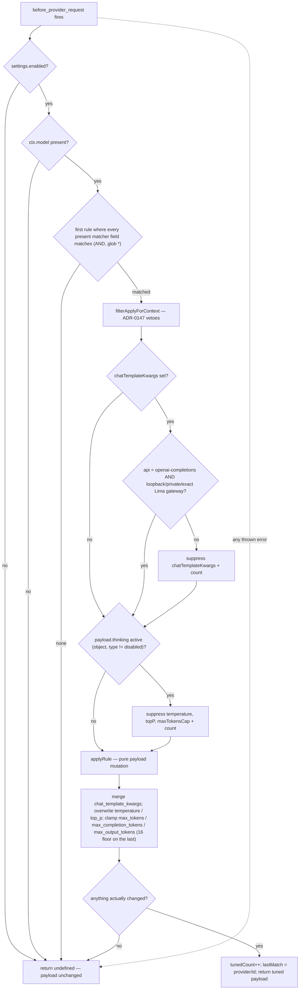
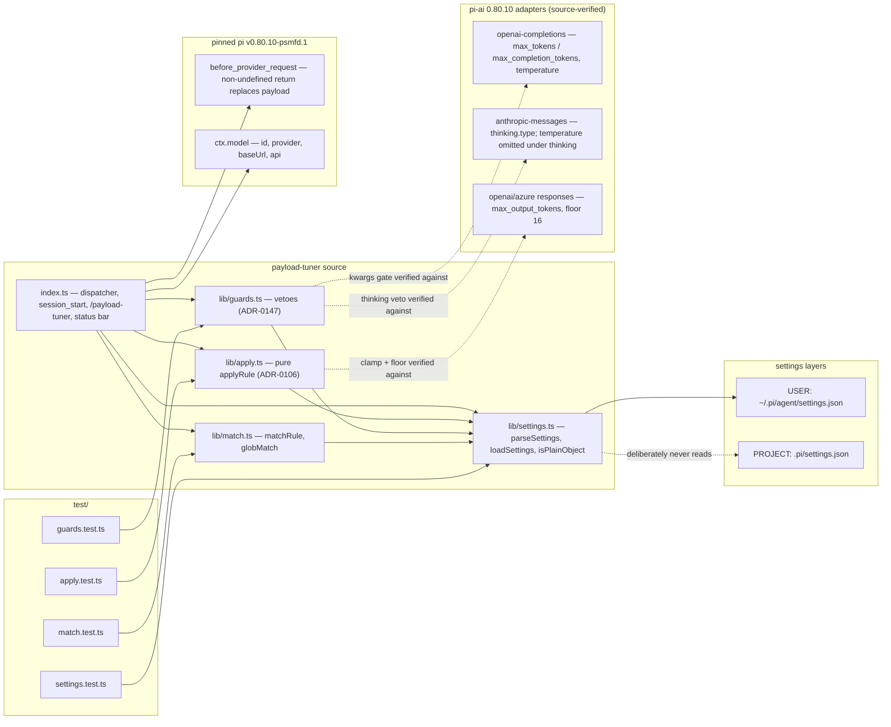

# payload-tuner

Per-request wire-payload tuning for local models (ADR-0106, ADR-0147, #769).

On `before_provider_request` — the extension-facing payload hook, where a
non-`undefined` return replaces the outgoing wire payload — the resolved
model (`ctx.model`) is matched against user-configured rules and the first
match's tweaks are applied. The motivating use case is the local oMLX
workhorse: set a stable model-appropriate reasoning effort, normalize sampling
when evidence supports it, and clamp generation length.

## What it tunes

| Tweak | Payload field | Notes |
| --- | --- | --- |
| `chatTemplateKwargs` | `chat_template_kwargs` (merged) | oMLX/vLLM-style servers; e.g. `{"reasoning_effort": "medium"}` for the gpt-oss workhorse (#1052 — the top-level `reasoning_effort` param is ignored by oMLX 0.5.7) or `{"enable_thinking": false}` for the GLM fallback. Guarded: local `openai-completions` targets only (see Defensive vetoes) |
| `temperature` | `temperature` | overwrite; skipped when the payload carries active extended thinking |
| `topP` | `top_p` | overwrite; skipped under active extended thinking |
| `maxTokensCap` | `max_tokens` / `max_completion_tokens` / `max_output_tokens` | only lowers an emitted value; never raises, never adds; `max_output_tokens` floored at 16 (Responses API rejects lower); skipped under active extended thinking |

## Defensive vetoes (ADR-0147, superseding ADR-0110)

A matched rule's `apply` block is filtered per request BEFORE application —
the extension's fail-open posture covers its own errors, not a
successfully-applied mutation that 400s at the provider:

- **`chatTemplateKwargs`** applies only when the resolved model is
  `api: "openai-completions"` **and** its baseUrl host is loopback, RFC 1918,
  or exactly Lima's well-known `host.lima.internal` gateway. Arbitrary
  `.internal` names and lookalikes remain rejected. API family alone is
  insufficient — GitHub Copilot routes cloud models through
  `openai-completions` on a public baseUrl, where unknown fields may 400.
- **`temperature`, `topP`, `maxTokensCap`** are skipped when the outgoing
  payload carries an active extended-thinking config (`thinking` object
  with `type !== "disabled"`): the Anthropic adapter deliberately omits
  `temperature` under thinking (its guard runs before this hook), derives
  the thinking budget from `max_tokens` before the hook (a later clamp
  could push `max_tokens` below `budget_tokens`), and Anthropic's API
  forbids `top_p` alongside thinking.

Vetoes are silent per request (the tuning philosophy: never intrude) but
counted — `/payload-tuner` reports `suppressed: <field>=<n>` so a rule that
is doing less than configured is visible to the operator.

### Decision flow



## What it never does

- **Never touches `messages`, `system`, or tools content.** The mutated
  fields are not part of the cached prefix, so the extension is
  prefix-cache-safe by construction — this is the ADR-0032 reconciliation
  recorded in ADR-0106. Token *savings* live elsewhere: context-manager
  (continuous, `context` hook) and compaction-optimizer (episodic).
- **Never blocks a turn.** Any error, malformed config, or unrecognized
  payload shape leaves the payload unchanged (fail open; the extension
  runner additionally catches handler errors).
- **Never varies `chat_template_kwargs` turn-to-turn** within a session —
  rules are static config; the server-side rendered prompt must stay
  stable or the oMLX prefix cache churns (ADR-0106 invariant).

## Configuration (USER layer only)

`extensionSettings.payloadTuner` in `~/.pi/agent/settings.json`. The
project layer is ignored entirely (ADR-0094 posture). Inert by default;
parsing fails closed to disabled on any malformed input — including
unrecognized keys at any level (a typo'd field name disables the extension
rather than silently half-applying the rule) and empty no-op blocks. See
`settings.schema.json` for the full schema.

Settings are read once, in `session_start`; a mid-session edit to
`settings.json` has no effect until the next session (there is no
in-session reload command).

```jsonc
"extensionSettings": {
  "payloadTuner": {
    // The tracked settings.example.json keeps this false. Copy/customize the
    // rule in USER-layer settings.json, then opt in explicitly.
    "enabled": false,
    "rules": [
      {
        // Exact Lima-hosted gpt-oss workhorse policy. Explicit medium keeps
        // the rendered template stable and is the quality default. Evaluate
        // "low" separately before using it as a latency-oriented alternative.
        "match": {
          "provider": "omlx",
          "baseUrl": "http://host.lima.internal:8000/v1",
          "modelId": "coding-workhorse"
        },
        "apply": {
          "chatTemplateKwargs": { "reasoning_effort": "medium" }
        }
      }
    ]
  }
}
```

Match fields (`provider`, `baseUrl`, `modelId`) AND together; values
support `*` as an anchored multi-character wildcard. First matching rule
wins.

For the operator-local policy, preserve the exact match and change only
`enabled` to `true`. Do not add `temperature`, `topP`, or `maxTokensCap` without
current model-specific evidence. Start a fresh session, run `/payload-tuner`,
and confirm tuned requests do not increment the `chatTemplateKwargs` suppression
counter.

### Communication flow

```mermaid
sequenceDiagram
    participant Core as pi core
    participant Tuner as payload-tuner
    participant Disk as ~/.pi/agent/settings.json (USER layer)
    participant Op as operator

    Note over Core,Tuner: session start (once per pi process, subagent children included)
    Core->>Tuner: session_start
    Tuner->>Disk: read extensionSettings.payloadTuner
    Disk-->>Tuner: settings JSON (or read/parse error)
    alt malformed or missing block
        Tuner->>Tuner: settings = DISABLED (fail closed)
    else valid enabled block
        Tuner->>Tuner: settings = enabled + rules
    end
    Tuner->>Tuner: reset tunedCount / lastMatch / suppressedCounts
    Tuner->>Core: ctx.ui.setStatus "tuner on (N)" / "tuner off"

    Note over Core,Tuner: every outgoing provider call
    Core->>Tuner: before_provider_request (payload)
    alt disabled, no ctx.model, no rule match, or handler throws
        Tuner-->>Core: undefined — payload ships unchanged (fail open)
    else rule matched
        Tuner->>Tuner: filterApplyForContext vetoes (ADR-0147)
        Tuner->>Tuner: applyRule pure mutation (ADR-0106)
        alt payload changed
            Tuner-->>Core: tuned payload (replaces wire body)
        else no-op after vetoes
            Tuner-->>Core: undefined
        end
    end

    Note over Op,Tuner: on demand
    Op->>Tuner: /payload-tuner
    Tuner-->>Op: ON/OFF; rules=N; tuned=N; last=provider/id; suppressed counters
```

Subagent fan-out is covered by construction: each child is a separate pi
process that repeats the `session_start` load independently (see Fan-out
coverage below).

## Observability

- `/payload-tuner` — status notification: enabled, rule count, requests
  tuned this session, last matched model, and per-field `suppressed:`
  veto counters (ADR-0147).
- Status bar — when a UI is attached, a persistent `🎛 tuner on (N)` /
  `🎛 tuner off` segment, refreshed on every `session_start`.

## Fan-out coverage

Subagents are separate `pi` processes with their own user-layer extension
discovery, so every fan-out child self-loads the tuner and applies the
same static rules independently — no cross-process coordination, because
v1 holds no dynamic state.

## Verified payload shape

The oMLX provider block in `models.json` uses `api: "openai-completions"`;
the pinned adapter (`pi-ai` 0.80.10 `openai-completions.js` `buildParams`)
emits top-level `temperature` and `max_tokens` or `max_completion_tokens`
(compat-dependent), and the hook's replacement payload is serialized
verbatim — so an added top-level `chat_template_kwargs` reaches the
server body unchanged.

Adjacent families (same pin, per ADR-0147's retained verification): plain/Azure
OpenAI Responses emit `max_output_tokens` (server minimum 16); the default
`openai-codex-responses` provider emits **no** token-limit field at all
(the clamp is a no-op there by design); `anthropic-messages` emits
`max_tokens`, omits `temperature` entirely when thinking is enabled, and
sets a `thinking: { type: ... }` object on the payload — the predicate the
thinking veto reads. In every adapter, `buildParams` runs first and the
hook's return ships verbatim with no re-validation.

### Dependencies



No imports from `shared/` or sibling extensions — the extension is fully
self-contained.

## Tests

`scripts/test-payload-tuner.sh` runs `test/*.test.ts` (node:test via tsx):

- `match.test.ts` — matcher glob semantics.
- `apply.test.ts` — per-shape application, the clamp's
  never-raise/never-add behavior, and the idempotence regression (double
  application is byte-identical — the same stability property
  context-manager tests).
- `settings.test.ts` — fail-closed settings parsing, including
  unknown-key rejection at every level (no silent half-application) and
  no-op-block rejection.
- `guards.test.ts` — the ADR-0147 veto surface: loopback/RFC 1918 and exact
  Lima-gateway classification, lookalike negatives, the Copilot public-baseUrl case,
  active-thinking detection (including the no-`type`-key
  fail-toward-suppression edge), the per-field veto matrix,
  fail-toward-suppression on unknown api / unparseable baseUrl, and the
  no-mutation-of-input invariant of `filterApplyForContext`.
