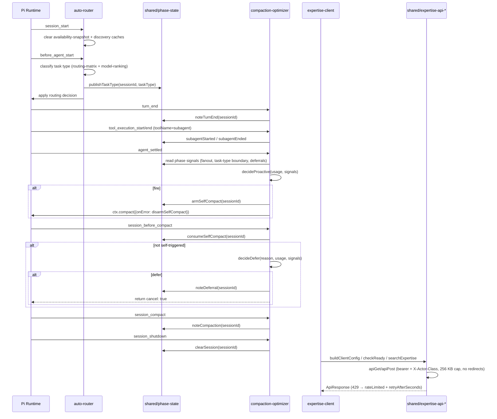
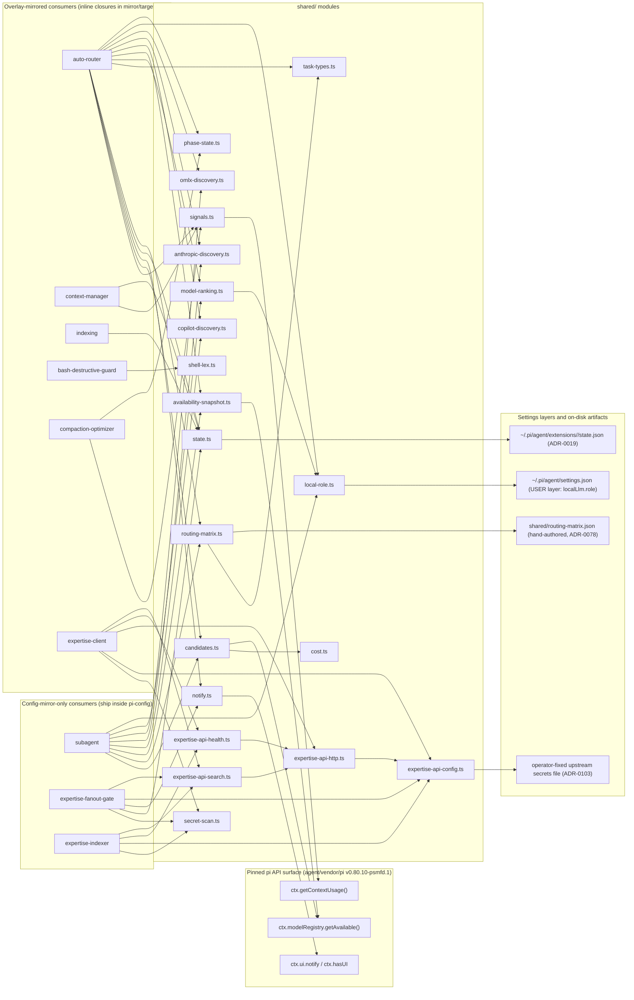

# shared/ — Pi Extension Suite foundation

A small internal **library** consumed by the Pi Extension Suite extensions
(auto-router, compaction-optimizer, context-manager, indexing, subagent), the
bash-guard family (bash-destructive-guard, via `shell-lex.ts`), and the
expertise stack (expertise-client, expertise-fanout-gate, expertise-indexer).
It is **not a loadable pi extension**: it has no `index.ts`, so pi's
auto-discovery (`~/.pi/agent/extensions/*/index.ts`) skips it. Consumers import
its modules by relative path, e.g.
`import { getUsage } from "../shared/signals.ts";`. See [ADR-0030](../../../adrs/0030-shared-foundation.md).

It is the single source of truth for context-usage signals, the credentialed
candidate-model menu, per-model cost normalization, notification formatting,
the per-extension state convention, cross-extension phase signals, and the
expertise-API client stack — so no extension re-derives these or hardcodes
thresholds.

## Lifecycle & communication

How the stateful shared modules wire into the pi lifecycle: auto-router
publishes phase signals that compaction-optimizer's when-policy consumes
(ADR-0109), and the expertise extensions talk to the API through the
`expertise-api-*` stack (ADR-0103).



## Modules

| Module | Exports | Purpose |
|---|---|---|
| `signals.ts` | `getUsage`, `classify`, `THRESHOLDS`, `NormalizedUsage`, `UsageLevel` | Normalized view over `ctx.getContextUsage()` (`{ tokens, window, pct, level }`, `null` when unknown) + the suite thresholds `PRUNE_AT=0.70`, `ESCALATE_AT=0.85`, `FORCE_COMPACT_AT=0.90`. |
| `candidates.ts` | `getCandidates`, `Candidate`, `CandidateOptions` | Credentialed-model menu from `ctx.modelRegistry.getAvailable()`, optionally filtered by a `provider/id` allowlist. |
| `cost.ts` | `normalizeCost`, `ModelCost`, `ZERO_COST` | The per-model cost shape (`input`/`output`/`cacheRead`/`cacheWrite` per MTok) and its normalizer; local models priced at zero. Consumed via `candidates.ts`. |
| `notify.ts` | `notify`, `formatMessage`, `NotifyLevel` | `[pi-suite:<scope>]`-tagged notifications over `ctx.ui.notify`, guarded on `ctx.hasUI`. |
| `state.ts` | `loadState`, `saveState`, `stateFile`, `stateDir`, `STATE_SCHEMA_VERSION`, `VersionedState` | Schema-versioned per-extension JSON state under `~/.pi/agent/extensions/<namespace>/state.json` (ADR-0019 data subtree). No extension writes another's state. |
| `shell-lex.ts` | `lex`, `preprocessCommand`, `deglueWordSubstitutions`, `stripEnvAssignments`, `stripHeredocs`, `hasMinusC`, `Segment`, `Redirect` | Quote-aware shell-command lexer for the bash-guard family (ADR-0072): segments a raw command on unquoted control operators, joins quote-adjacent words, normalizes `$IFS`, captures stdin/pipe-sink/redirection, and degluing word-internal empty command substitutions. Parsing only — the consuming guard owns policy. **Not** a POSIX parser; value-dependent expansion is out of scope by design. |
| `local-role.ts` | `DEFAULT_LOCAL_ROLE`, `LocalRole`, `LOCAL_PROVIDERS`, `isLocalProvider`, `isLocalModelKey`, `parseLocalRole`, `readLocalRole`, `filterLocalCandidates` | The global local-LLM role lever (`extensionSettings.localLlm.role: full \| classifier-only \| off`, ADR-0094/#685). USER-layer settings only — project layers are never consulted. The single "what counts as local" list; `model-ranking.ts` imports it so eligibility filtering and ranking cannot drift. Shared by auto-router and subagent. |
| `phase-state.ts` | `publishTaskType`, `noteTurnEnd`, `subagentStarted`/`subagentEnded`/`subagentInFlight`, `turnsSinceTaskTypeChange`, `taskTypeChangedSinceCompaction`, `noteCompaction`, `noteDeferral`/`deferralCount`, `armSelfCompact`/`consumeSelfCompact`/`disarmSelfCompact`, `clearSession` | In-memory, session-keyed phase signals for the optimization suite (#677, ADR-0109): auto-router publishes its task-type label, compaction-optimizer wires subagent/turn lifecycle events and consumes both for the compaction when-policy. Process-local (no I/O); expected foundation for #772's unified optimization-layer state. |
| `task-types.ts` | `MATRIX_TASK_TYPES`, `MatrixTaskType` | Closed task taxonomy shared by classifier parsing and strict matrix validation, preventing lockstep drift. |
| `routing-matrix.json` | — (data, no code) | Hand-authored capability floor per task type (#350/#363): which models clear the bar for each classifier-emitted task-type label. Seeded with the `omlx/coding-workhorse` row; human-reviewed, never auto-written. **Consulted by auto-router's `resolveByTaskType` since #352** (ADR-0078) when matrix routing is enabled — closed-world for matrix picks. Structure/staleness is guarded by the strict loader, tests, and `validate.sh` (`9b-routing-matrix-bis`). |
| `routing-matrix.ts` | `defaultMatrixPath`, `loadRoutingMatrixResult`, `loadRoutingMatrix`, `gardenMatrix`, `parseMatrixTier`, `MATRIX_VERSION`, `MatrixTier`, `MatrixEntry`, `RoutingMatrix`, `MatrixGardening`, diagnostics types | Strict typed loader for matrix metadata/rows (#747): stable diagnostics distinguish missing, unreadable, invalid JSON/schema/version, and stale policy, while retaining each reviewed rationale for the read-only proposal report (#750). `gardenMatrix` powers auto-router's matrix-gardening report (#656). The compatibility adapter preserves fail-soft `null` routing behavior. Schema/lifecycle reference: [standalone matrix lifecycle v1](https://github.com/psmfd/pi-auto-router/blob/main/MATRIX_LIFECYCLE_V1.md). |
| `model-ranking.ts` | `costRank`, `orderRankedCandidates`, `resolveCapabilityPick`, `resolveTierPick`, `isLocalCandidate`, `RankOptions`, `COST_RANK_K` | Shared deterministic model ranking primitives (#658): capability floor first, then local-first lane when local use is allowed (local set from `local-role.ts`), then cheapest-capable ranking (`input + k·output`, k=1), then context-window and `provider/id` tie-breaks. `resolveTierPick` (#656) is the quality-first tier ladder — cost drops out; ties break on window then lexical order. Used by auto-router and subagent provider policy. |
| `availability-snapshot.ts` | `buildAvailabilitySnapshot`, `getAvailabilitySnapshot`, `peekAvailabilitySnapshot`, `clearAvailabilitySnapshot`, `AvailabilitySnapshot` | ADR-0104 canonical registry + Copilot/Anthropic/oMLX availability generation shared by parent and subagent. One registry read, immutable sorted candidates/filter evidence, stable SHA-256, session-frozen cache with prior-generation cancellation; read-only peek never starts discovery; no credentials or capability mutation. |
| `copilot-discovery.ts` | `resolveCopilotFilter`, `getEnabledCopilotModels`, `clearCopilotCache`, … | Live GitHub Copilot `/models` tier discovery (ADR-0035; moved here from auto-router in #536). Fail-open, host-pinned, five-second bounded, 20-min cache of model-id strings only — never the JWT. Cache epochs reject stale in-flight writes after clear. Consumed through the canonical snapshot. |
| `anthropic-discovery.ts` | `resolveAnthropicFilter`, `getServedAnthropicModels`, `clearAnthropicCache`, … | Live Anthropic `/v1/models` discovery (#538; moved to shared by ADR-0104): filters retired ids, host-pinned, five-second bounded and fail-open, with a 20-min model-id-only cache. Cache epochs reject stale in-flight writes after clear. Consumed through the canonical snapshot. |
| `omlx-discovery.ts` | `resolveOmlxFilter`, `getServedOmlxModels`, `clearOmlxCache`, … | Live oMLX `/v1/models` probe (#364, ADR-0081). Loopback-only, key never cached, 60s model-id cache; **authoritative even when empty** (confirmed-down drops all omlx), null when inconclusive/not applicable. Cache epochs reject stale in-flight writes after clear. Consumed through the canonical snapshot. |
| `secret-scan.ts` | `SECRET_PATTERNS`, `scanRawString` | Canonical TS secret-detection pattern set + a raw-string scanner returning category names only (never the matched text). One of the three ADR-0071 lockstep copies (with `secrets-guard/index.ts` + `hooks/secrets-guard.sh`), verified by `validate.sh` §6b-bis. Moved here from `expertise-client` (ADR-0088, #635) so both `expertise-client` (`scanForSecrets`) and the config-mirror-shipped `expertise-indexer` consume it without a cross-mirror import. |
| `expertise-api-config.ts` | `buildClientConfig`, `loadUpstreamSecrets`, `resolveUpstreamSecretsPath`, `isLoopbackHost`, env parsers, `ClientConfig`, `ConfigResult`, `ENV_*` | Dual-profile agent-expertise-api configuration (ADR-0103): retained loopback/API-key `PI_EXPERTISE_*` plus upstream pre-provisioned bearer/static-OIDC `EXPERTISE_API_*`. Remote bearer origins require HTTPS; fixed operator files only, no repo discovery. Shared by the tool, fanout gate, and audit runner. |
| `expertise-api-http.ts` | `apiGet`, `apiPost`, `errorDetail`, `ApiResponse`, `MAX_BODY_BYTES`, agent header constants | Bounded HTTP: protected calls carry bearer + `X-Actor-Class: agent`; all carry stable pi `User-Agent`; anonymous readiness omits auth. Redirects refused, 256 KB cap, injectable `fetchImpl`. |
| `expertise-api-health.ts` | `checkReady` | `/health/ready` preflight against the configured local or upstream API origin. |
| `expertise-api-search.ts` | `searchExpertise`, `SEARCH_PATH`, `SearchParams`, `SearchResult`, `LIMIT_MIN`/`MAX` | Read-only semantic search (`GET /expertise/search/semantic`, `q` + clamped `limit`). 429s return a refusal with `rateLimited: true` + parsed `retryAfterSeconds` so programmatic callers (the fanout gate's session backoff) need not sniff prose. Moved from `expertise-client/lib/search.ts` (ADR-0095). |

## Dependency graph

Module-to-consumer edges, shared-internal edges, and the pinned runtime
surfaces each module relies on. Overlay-mirrored consumers ship their shared
closure inlined at sync time per `mirror/targets.yml` (ADR-0065/0088).



## Design contracts

- **Structural typing.** Each function types against the minimal slice of
  `ExtensionContext` it needs (e.g. `UsageContext`, `CandidatesContext`), so the
  pure logic unit-tests without a live pi runtime. Filesystem readers take an
  injectable directory for the same reason (`state.ts`, `local-role.ts`).
- **`null` means unknown.** `getUsage` returns `null` when usage or window size
  is unavailable (pi's `getContextUsage()` may be undefined) — callers must not
  treat `null` as "empty context".
- **Append-side / prefix-safe.** Nothing here rewrites the cached message prefix;
  consumers must prune the message tail (suite invariant — see the plan and #338).
- **No cross-extension state writes.** `state.ts` is namespaced per extension.
- **One "local" list.** `local-role.ts`'s `LOCAL_PROVIDERS` is the single
  definition of what counts as a local provider; ranking (`model-ranking.ts`)
  imports it rather than re-declaring (#788).

### Decision ladders, gates, and vetoes

The policy shapes shared/ implements or feeds:

```mermaid
flowchart TD
    subgraph LR1["Local-role gate — local-role.ts (ADR-0094)"]
        LR_A["read extensionSettings.localLlm.role (USER layer only)"] --> LR_B{"role?"}
        LR_B -- full --> LR_C["local allowed: classifier and target"]
        LR_B -- classifier-only --> LR_D{"context?"}
        LR_D -- classifier --> LR_E["local allowed"]
        LR_D -- target --> LR_F["local stripped (filterLocalCandidates)"]
        LR_B -- off --> LR_G["local stripped everywhere"]
        LR_B -- unrecognized --> LR_C
    end

    subgraph MR2["Capability pick ladder — model-ranking.ts (#658)"]
        MR_A["pool (post local-role filter)"] --> MR_B{"capability floor met?"}
        MR_B -- no --> MR_C["excluded"]
        MR_B -- yes --> MR_D{"preferLocal and local present?"}
        MR_D -- yes --> MR_E["local-first lane wins"]
        MR_D -- no --> MR_F["cheapest by input + k·output (k=1)"]
        MR_F --> MR_G["ties: larger contextWindow, then provider/id lexical"]
    end

    subgraph RM3["Matrix task-type floor — routing-matrix.ts (ADR-0078)"]
        RM_A["classifier task-type label"] --> RM_B{"matrix row valid and fresh?"}
        RM_B -- "no / stale / invalid" --> RM_C["fail-soft: null — fall through to default policy"]
        RM_B -- yes --> RM_D["closed-world candidate list for the task type"]
    end

    subgraph AV4["Availability posture — availability-snapshot.ts (ADR-0104)"]
        AV_A["one registry read"] --> AV_B{"Copilot/Anthropic probe outcome?"}
        AV_B -- "timeout / error" --> AV_C["fail OPEN: keep provider candidates"]
        AV_B -- ok --> AV_D["filter to served ids"]
        AV_A --> AV_E{"oMLX probe outcome?"}
        AV_E -- inconclusive --> AV_F["fail OPEN: no omlx opinion"]
        AV_E -- "confirmed empty" --> AV_G["authoritative: drop all omlx"]
        AV_E -- non-empty --> AV_H["filter to served omlx ids"]
    end

    subgraph SS5["Secret gate — secret-scan.ts (ADR-0071/0088)"]
        SS_A["raw string (tool params, telemetry, indexed candidate)"] --> SS_B["scanRawString vs SECRET_PATTERNS"]
        SS_B -- match --> SS_C["block/redact — category names only, never the matched text"]
        SS_B -- clean --> SS_D["pass through"]
    end
```



The compaction when-policy that consumes `phase-state.ts` signals is documented
(with its own decision flowchart) in
[compaction-optimizer's README](../compaction-optimizer/README.md) (ADR-0109).

## API provenance

Original Phase 0 verification (issue #328) covered `ctx.getContextUsage()`,
`ctx.model.contextWindow`, `ctx.modelRegistry.getAvailable()`, and the model
`cost` fields against pi v0.79.0. The pin has since advanced — the current
reference is **`agent/vendor/pi/VERSION` (v0.80.10-psmfd.1)** — and
later-added modules were verified against their contemporary pins in their own
ADRs: the subagent/turn lifecycle events and `session_before_compact.reason`
consumed via `phase-state.ts` wiring (ADR-0109, v0.80.10), and the discovery
endpoints behind `availability-snapshot.ts` (ADR-0104). Verify new API claims
against the vendored types for the pinned version, not a `node_modules` copy.

## Tests

```sh
./scripts/test-shared.sh          # node:test via tsx; run from repo root
VERBOSE=1 ./scripts/test-shared.sh
```

Coverage boundary: `shared/test/` covers every module except
`expertise-api-config.ts`, `expertise-api-health.ts`, `expertise-api-search.ts`,
and `secret-scan.ts`, whose behavior is exercised by name in their consumers'
suites (`expertise-client/test/` and `expertise-indexer`'s suite), and
`task-types.ts`, exercised through `routing-matrix.test.ts`'s strict-validation
cases. `expertise-api-http.ts`
has direct tests here (redirect refusal, the 256 KB truncation path, header
composition) since no consumer suite hits those edges. When adding a shared
module, prefer a direct `shared/test/` file; lean on consumer suites only when
the module is a thin seam those suites already pin.

Type-checking and linting are covered by the repo-wide `scripts/typecheck-extensions.sh`
and `scripts/lint-extensions.sh` (ADR-0021), which discover `shared/` automatically.
