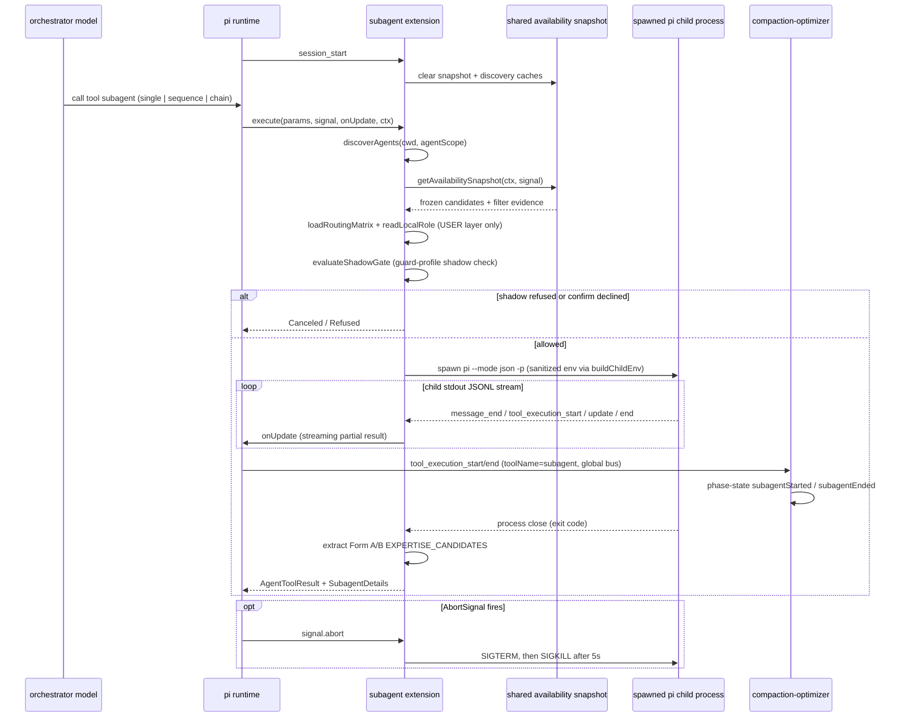
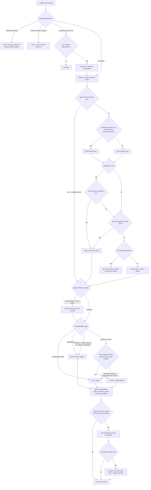
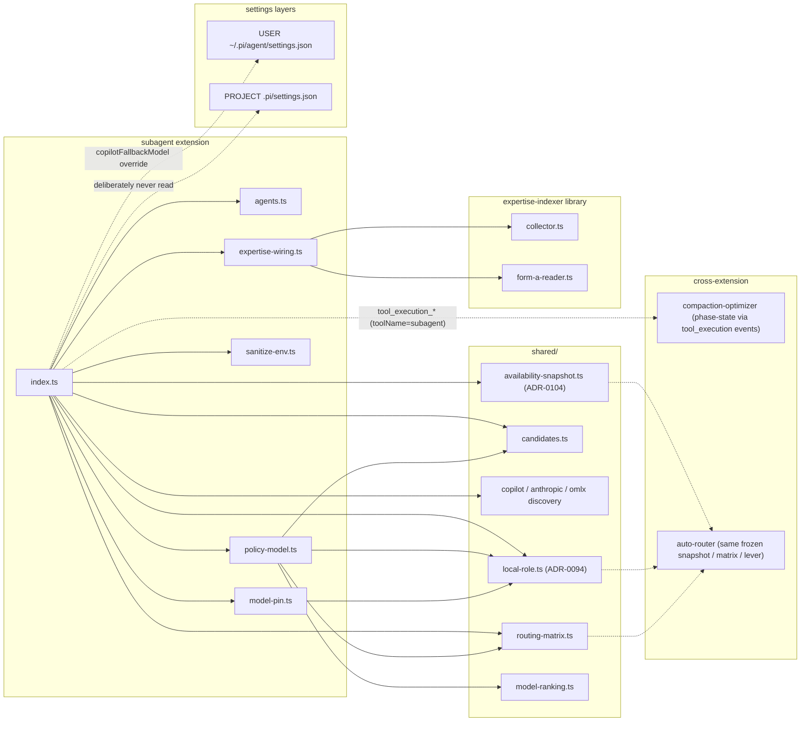

# subagent

> **Vendored from pi 0.80.2** (source: `examples/extensions/subagent/` in the pi 0.80.2 release tarball); re-paired from pi 0.78.1 on 2026-07-07 (pi_config #396; prior audits: 0.78.1 pi_config #296, 0.75.4 pi_config #136). Audited at the v0.80.6-psmfd.1 runtime bump (2026-07-11): upstream `examples/extensions/subagent/` is byte-identical between v0.80.2 and v0.80.6, so the 0.80.2 pairing remains current and no re-pair was performed. Re-audited at the v0.84.1-psmfd.1 runtime bump (2026-08-11, #953): upstream `examples/extensions/subagent/` is byte-identical between v0.80.2 and v0.84.1 — every tracked file carries the same blob SHA — so the 0.80.2 pairing remains current across the 0.82.0/0.82.1/0.83.0/0.84.0/0.84.1 range and no Procedure B re-pair was performed; `bump-pi-runtime.sh`'s audit signal independently confirmed this and refreshed `PATCH_MANIFEST.json`'s `pinnedPiVersion` as a pure pin refresh. Re-audited at the v0.80.10-psmfd.1 runtime bump (2026-07-20, #793 review): the 0.80.2 vendor pairing remains current; `PATCH_MANIFEST.json`'s `pinnedPiVersion` tracks the runtime pin. Trivial upstream deltas adopted (`CONFIG_DIR_NAME` / `getAgentDir()` usage in `agents.ts` and the tool description help strings). Patch #3 (`tool_execution_*` UI refresh) retained and **expanded** to also consume `tool_execution_update` — pi 0.80.2 still ships the dead `tool_result_end` branch in the example (unchanged since 0.78), and pi's runtime emits `tool_execution_{start,update,end}` + a separate `tool_result` middleware event per `pi/docs/rpc.md` § 855–898 and `pi/docs/extensions.md` § 596–615. Consuming `tool_execution_update` closes pi_config #46. Patches #4a–d (Copilot fallback rung, oMLX liveness gate, spawn-time pin gate, supporting imports) are our own ADR-0080/ADR-0081 policy layer; #748/ADR-0104 now feeds them from the canonical parent/child availability snapshot. Patches #1 (full per-task output) and #2 (failed-task diagnostics) were dropped at the 0.75.4 re-audit (pi_config #136) when upstream adopted them per [earendil-works/pi#4710](https://github.com/earendil-works/pi/issues/4710).
>
> When updating, record the new source pi version here and in the commit message. See [ADR-0001](../../../adrs/0001-subagent-orchestration-substrate.md). The audit trap that let patches #4a–d go undocumented between 0.75.4 and 0.80.2 is tracked as pi_config #582 — read that before the next re-pair.

## Local patches

This vendored copy carries downstream patches that diverge from upstream `earendil-works/pi-mono` HEAD. When bumping the snapshot, re-apply or drop these patches based on whether they have been merged upstream. **Every patch below must be re-verified at each re-pair; adding a new local divergence to the vendored source requires appending a row here in the same PR AND regenerating `PATCH_MANIFEST.json` — `scripts/validate-subagent-drift.sh` (added under pi_config #582) fails `scripts/validate.sh` when either is missing.** See [`docs/vendor-updates.md`](../../../docs/vendor-updates.md) § Subagent extension for the full re-pair (Procedure B) and new-patch (Procedure A) workflows.

| # | Patch | Files | Rationale | Tracking |
|---|---|---|---|---|
| 3 | `tool_execution_*` UI refresh | `index.ts` (event-loop branch replacing dead `tool_result_end`) | Upstream 0.80.2's example still listens for `tool_result_end` with `event.message`, but pi's runtime does NOT emit that event — confirmed against `pi/docs/rpc.md` § 855–898 and `pi/docs/extensions.md` § 596–615, which document `tool_execution_start` / `tool_execution_update` / `tool_execution_end` (+ `tool_result` as a separate middleware event, not consumed here). We replace the dead branch with an `emitUpdate()` call on **all three** tool-execution edges so the orchestrator sees per-tool-call streaming progress during long child runs, without injecting synthetic messages into `currentResult.messages` (which would corrupt `getFinalOutput`). The `tool_execution_update` edge closes pi_config #46; surfacing the `partialResult` payload in the details table remains a future concern. | pi_config #46, expanded in pi_config #396; no upstream issue (upstream's example still points at a dead event) |
| 4a | Copilot fallback rung | `index.ts` (`DEFAULT_COPILOT_FALLBACK`, `readFallbackModelSetting`, `buildCopilotFallback`, `sanitizeFallbackModelId` import) | When a child agent's slash-qualified model pin is unavailable at spawn time, substitute `github-copilot/gpt-5-mini` by default (operator-overridable from USER-layer settings) before the session default. Registry presence and live-enabled IDs now come from ADR-0104's canonical snapshot, so the fallback and provider policy cannot disagree about a tier-gated model. | pi_config #519, #536, [ADR-0080](../../../adrs/0080-copilot-fallback-rung.md), [ADR-0104](../../../adrs/0104-deterministic-model-availability-snapshots.md) |
| 4b | oMLX liveness gate | `index.ts` (canonical snapshot IDs + `servedOmlxIds` wording input), `../shared/availability-snapshot.ts` | ADR-0081's operator-local oMLX probe is composed once into the shared snapshot. A confirmed-down/unloaded workhorse is absent from both pin and policy candidates and re-enters the fallback ladder; inconclusive evidence remains fail-open. | pi_config #534, [ADR-0081](../../../adrs/0081-omlx-spawn-liveness-gate.md), [ADR-0104](../../../adrs/0104-deterministic-model-availability-snapshots.md) |
| 4c | Spawn-time model-pin gate | `index.ts` (`resolveModelPin` call site, `CopilotFallback` registry/live evidence, `pinNote` field on `SingleResult`, argv handling and note surfacing), `model-pin.ts` | Enforce that a slash-qualified pin only reaches child argv when its exact `provider/id` survives the canonical credential + live-availability snapshot. Dropped pins surface the effective rung; static registry presence is retained separately so a snapshot-filtered Copilot fallback still reports `tier-gated` rather than generic absence. | pi_config #519, [ADR-0080](../../../adrs/0080-copilot-fallback-rung.md), [ADR-0104](../../../adrs/0104-deterministic-model-availability-snapshots.md) |
| 4d | Support imports + separate `model-pin.ts` | `index.ts` (imports from `../shared/availability-snapshot.ts` and `./model-pin.ts`), `model-pin.ts`, `test/model-pin.test.ts` | Backing implementation for patches #4a–c. `model-pin.ts` remains a purely-local sibling; provider discovery now enters through the shared canonical snapshot rather than direct per-provider calls. | (support surface for #4a–c and ADR-0104) |
| 5 | Sanitize spawned child env | `index.ts` (`env: buildSanitizedEnv(process.env)` on the child `spawn()` call, import of `./sanitize-env.ts`), `sanitize-env.ts`, `test/sanitize-env.test.ts` | Enforce the expertise trust boundary structurally: strip `PI_EXPERTISE_ALLOW_LOCALDEV_WRITE`, upstream `EXPERTISE_API_TOKEN`, and mounted-token pointer `EXPERTISE_API_TOKEN_FILE` from every child, and replace `EXPERTISE_API_SECRETS_FILE` with `/dev/null` so child extensions cannot rediscover the default bearer file. Canonical expertise stays parent-fetched/injected and only the orchestrator can create. Default mode remains passthrough-with-explicit-denies; strict allowlists are patch #11 (pi_config #606). `sanitize-env.ts` is a purely-local sibling of the vendored source, same pattern as `model-pin.ts` (patch #4d). | pi_config #596, pi_config #645, epic pi_config #595, [ADR-0103](../../../adrs/0103-upstream-expertise-static-oidc-consumption.md), [ADR-0121](../../../adrs/0121-mounted-oidc-token-consumption.md) |
| 6 | Wire expertise collector into runtime | `index.ts` (`expertiseInjection` on `SequenceItem`/`ChainItem`/single params, extraction on `SingleResult`, coalescing in `makeDetails`), `expertise-wiring.ts`, tests | The historically named expertise gate performs one parent-side canonical search and injects an identical block into every research sequence item. The subagent extension prepends user-role context, extracts Form A/B candidates, attributes them from `SingleResult.agent`, and coalesces across all children. | pi_config #611, pi_config #1055, [ADR-0148](../../../adrs/0148-serial-multi-agent-execution.md) |
| 7a | Guard-profile signal for report-only wrappers | `agents.ts` (`guardProfile` field on `AgentConfig`, parsed from `guard-profile` frontmatter), `index.ts` (`applyGuardProfile(buildSanitizedEnv(...), agent.guardProfile)` at the child `spawn()` env), `sanitize-env.ts` (`applyGuardProfile`), `test/guard-profile.test.ts` | Wrapper-side half of the report-only enforcement chain (pi_config #551, ADR-0091): a wrapper declaring `guard-profile: report-only` (today: `linter`) has `PI_GUARD_PROFILE=report-only` exported into its child env, where `bash-destructive-guard`'s report-only profile turns the prose report-only contract into a mechanical gate. Set-or-delete semantics: the var is never inherited from the parent env (an undeclared wrapper cannot leak a parent value), and only the recognized value is exported (a typo'd frontmatter value yields no profile rather than a half-armed one). Parent-controlled at spawn time, so the child agent cannot un-certify itself. | pi_config #551, pi_config #554, ADR-0091, ADR-0082 (the #535 evaluation that motivated it) |
| 7b | Emit child model at invocation | `index.ts` (one `emitUpdate()` call in `runSingleAgent`, immediately after the `emitUpdate` closure is defined and before the child `spawn()`) | Surface the resolved child model at the **moment of invocation**, not only in the completion footer. Upstream first calls `emitUpdate()` on the child's first `message_end`, so nothing about a spawned subagent shows until its first assistant turn completes. The added spawn-time emit renders the initial `(running...)` state whose footer already carries `currentResult.model` — seeded from the spawn-time pin (`pin.modelArg`, patch #4c) — so a pinned/fallback-resolved child shows its model instantly; an unpinned child (no `--model`) fills the field in from its first `message_end` as before. The emit only reads `currentResult.messages`, so it cannot corrupt the accumulation `getFinalOutput` consumes. Same class of UI-refresh divergence as patch #3; no ADR. | pi_config #643 |
| 8 | Effective model in result titles | `index.ts` (`formatAgentModelLabel` helper plus single/chain/sequence result headings and sequence text summaries) | Show the effective subagent model in the user-visible title/status row, not only in the usage footer. Pinned/fallback-resolved children render `agent · provider/id` immediately because patch #7b seeds `currentResult.model`; unpinned/running children render `agent · model pending` until the first child model telemetry fills the field. This supports ADR-0090's operator-facing model auditability without changing child prompts, argv, or accumulated output. | pi_config #659, [ADR-0090](../../../adrs/0090-stable-router-subagent-model-policy.md) |
| 9 | Subagent policy model seam | `index.ts` (canonical snapshot candidates + `loadRoutingMatrix` + `readLocalRole`, `runSingleAgent` policy threading), `policy-model.ts` (`selectSubagentPolicyModel`/`isLocalForbiddenAgent`), `test/policy-model.test.ts` | Explicit wrapper pins remain authoritative; unpinned agents get the provider matrix's pick over the ADR-0104 live-filtered pool, with local included only when eligible per ADR-0094. The matrix decides the concrete model; a resolved policy pick still passes the pin gate, and a local-forbidden agent with no non-local pick fails closed. | pi_config #656, pi_config #657, pi_config #685, [ADR-0090](../../../adrs/0090-stable-router-subagent-model-policy.md), [ADR-0094](../../../adrs/0094-local-llm-role-lever.md), [ADR-0104](../../../adrs/0104-deterministic-model-availability-snapshots.md) |
| 10 | Guard-profile shadowing gate | `agents.ts` (`ProfiledShadow`, `detectProfiledShadows`, detection-only user-catalog probe under scope `project`, `evaluateShadowGate`, `shadowedProfiledAgents` on `AgentDiscoveryResult`), `index.ts` (fail-closed shadow gate in `execute()` ahead of the generic project-agent confirm; profile inheritance on the approved path), `test/guard-shadowing.test.ts` | Close ADR-0091's accepted gap: a project-scoped wrapper colliding with a guard-profiled user wrapper (e.g. `linter`) can no longer silently disarm enforcement. Tool-surface widening of a profiled name is refused outright (added structured tools would bypass the bash-scoped guard entirely); a profile-weakening shadow requires an interactive confirmation naming the disarmament, refuses headlessly, and inherits the user wrapper's profile on approval (strongest-wins). Deliberately independent of the caller-controlled `confirmProjectAgents` parameter. Ordinary project overrides of unprofiled names are untouched. | pi_config #671, [ADR-0093](../../../adrs/0093-guard-profile-shadowing-gate.md) |
| 11 | Per-wrapper strict env mode | `agents.ts` (`envStrict`/`envAllow`/`envAllowPrefixes` on `AgentConfig`, parsed from `env-strict`/`env-allow`/`env-allow-prefix` frontmatter — type-tolerant: the parser YAML-types scalars), `index.ts` (spawn call site uses `buildChildEnv(process.env, agent)`), `sanitize-env.ts` (`buildChildEnv` composing seam; `PI_` prefix + proxy vars added to the strict base), `test/strict-env-wiring.test.ts` | Wire the strict allowlist mode patch #5 shipped but never enabled: a wrapper declaring `env-strict: true` spawns its child with allowlist-only env (base POSIX/locale/terminal/Node plumbing + `PI_*` runtime namespace + proxy vars); `env-allow`/`env-allow-prefix` extend per wrapper with explicit justification. Secret-suffix keys (`*_TOKEN`, `*_API_KEY`, …) stay denied under strict unless exactly re-allowed — a `PI_`-prefixed secret like `PI_EXPERTISE_API_KEY` is still stripped — and `ALWAYS_DENY` beats every allow. All 21 first-party wrappers flipped (pinned by test); credential-bearing bash wrappers carry per-wrapper justified `env-allow` entries (see § Strict child env). Only a literal `true` enables strict — typos keep the safe default. | pi_config #606, pi_config #596, epic pi_config #595 |
| 12 | Local-LLM role lever + `local-llm` tag | `agents.ts` (`localLlm` on `AgentConfig`, parsed from `local-llm` frontmatter, literal-true only), `index.ts` (`readLocalRole` per tool call, `localRole` threaded to `runSingleAgent`, `applyLocalRole` pin backstop ahead of the spawn-time gate), `policy-model.ts` + `model-pin.ts` (first-party siblings), `test/policy-model.test.ts` | ADR-0094 (#685): local eligibility = global `extensionSettings.localLlm.role` lever (`full`/`classifier-only`/`off`) ∧ `local-llm: true` wrapper tag (default false — untagged/third-party wrappers never ride local) ∧ not structurally local-forbidden (the tag can never override the bash floor). The `applyLocalRole` backstop drops a local `model:` pin fail-closed — even when the registry is unreadable — with a visible pin note; children never run the classifier, so any restricted lever value strips local entirely here. The original 13 first-party `model: omlx/coding-workhorse` pins were migrated to `local-llm: true` tags; ADR-0149 subsequently promoted the typed-read-only `gitflow-expert`, bringing the explicit first-party eligibility set to 14 (pinned by test). | pi_config #685, [ADR-0094](../../../adrs/0094-local-llm-role-lever.md), [ADR-0149](../../../adrs/0149-gitflow-local-llm-eligibility.md) |
| 13 | Capability-tier quality floor | `agents.ts` (`capabilityTier` on `AgentConfig`, parsed from `capability-tier` frontmatter — exact enum values only, typos yield untiered selection), `policy-model.ts` (tier branch via `shared/model-ranking.ts` `resolveTierPick`), `test/policy-model.test.ts` | #656: a wrapper declaring `capability-tier: frontier\|capable\|fast` asks the provider matrix for the highest-quality credentialed model at or above that tier — quality-first ordering (tier rank desc, window desc, lexical; cost drops out), or-better semantics, falling through to untiered cheapest-capable when no tiered row qualifies, still respecting the ADR-0094 local-eligibility pool. Provider-agnostic rows remain inert when absent from ADR-0104's live-filtered candidates. | pi_config #656, [ADR-0094](../../../adrs/0094-local-llm-role-lever.md), [ADR-0090](../../../adrs/0090-stable-router-subagent-model-policy.md) |
| 14 | Canonical parent/child availability generation | `index.ts` (`getAvailabilitySnapshot`, live-filtered IDs for pin/fallback/policy, all-cache clear on `session_start`), `test/policy-model.test.ts` (wiring pin) | Parent routing and every child-selection seam consume one immutable registry observation with identical Copilot, Anthropic, and oMLX filters. Snapshot failure retains qualified-pin fail-open behavior; provider-matrix candidates fail empty. This removes the former oMLX-only policy filtering and separate Copilot fallback probe. Operator status/review/refresh semantics are defined in [the standalone matrix lifecycle reference](https://github.com/psmfd/pi-auto-router/blob/main/MATRIX_LIFECYCLE_V1.md). | pi_config #748, [ADR-0104](../../../adrs/0104-deterministic-model-availability-snapshots.md) |
| 15 | Spawn-depth guard | `index.ts` (`DEFAULT_MAX_SPAWN_DEPTH`/`MAX_SPAWN_DEPTH_CEILING`, `readMaxDepthSetting`, refusal gate at the top of `execute()`), `sanitize-env.ts` (`SUBAGENT_DEPTH_ENV`, `readSpawnDepth`, depth stamp in `buildChildEnv`), `test/sanitize-env.test.ts`, `test/spawn-integration.test.ts` | Children previously loaded the full extension set — including this `subagent` tool — so a wrapper whose tool surface grants (or defaults to) `subagent` let children fan out grandchildren invisibly: unbounded depth, no orchestrator visibility, multiplying token spend. Every child is now stamped `PI_SUBAGENT_DEPTH` = parent depth + 1 (set-or-increment, recomputed from the parsed parent value — a mangled inherited value resets to 0 rather than compounding), and `execute()` refuses before any discovery/spawn work once the process's depth has reached the user-layer `maxSpawnDepth` limit (default 1: children exist, grandchildren do not). Mechanically backs the orchestrator-protocol sub-agent obligation ("do not spawn additional agents on your own initiative"). See § Spawn-depth guard. | pi_config #841, [ADR-0118](../../../adrs/0118-subagent-spawn-depth-guard.md) |
| 16 | Shared chain/sequence result-row rendering | `index.ts` (`RowOpts`, chain/sequence row options and shared row/totals helpers), `test/render.test.ts` | Multi-result rendering shares row construction while chain retains step labels and sequence exposes queued/running/completed states. | pi_config #794, amended by #1055 |
| 17 | Bounded runtime provider failover | `index.ts`, `policy-model.ts`, runtime-failover/policy tests, shared session-unavailable state | A policy-selected child may retry once after a structured pre-tool 429. Explicit pins, defaults, generic failures, aborts, and post-tool failures never replay. Serial sequence items share live deny evidence while preserving the frozen availability snapshot. | pi_config #868, [ADR-0122](../../../adrs/0122-subagent-runtime-provider-failover.md), [ADR-0126](../../../adrs/0126-provider-session-circuit-breaker.md) |
| 18 | Default-suppress child context files | `agents.ts` (`contextFiles` on `AgentConfig`, parsed from `context-files` frontmatter — exact values `none`/`inherit` only, typos land on the suppressed default), `index.ts` (`--no-context-files` pushed onto child argv unless the wrapper declares `context-files: inherit`), `test/agents.test.ts`, `test/spawn-integration.test.ts` | Every child spawn previously cold-prefilled the global `AGENTS.md` orchestration playbook + project `CLAUDE.md` (~36.6KB ≈ 9K tokens) via pi's unconditional context-file discovery — content 20 of 21 first-party wrappers never reference and leaf subagents are forbidden to act on (no self-routing), and the dominant driver of the oMLX Memory Guard fan-out collapse (local-llm ADR-010). Children now spawn with `--no-context-files` by default; `context-files: inherit` opts a wrapper back in (today: `pi-agent-expert`, whose domain is this config itself). Deliberately per-wrapper-static rather than model-conditioned so a wrapper's prefill stays byte-identical across routing/failover outcomes (prefix-cache-stable; ADR-0032/0106 posture). | pi_config #889, [ADR-0124](../../../adrs/0124-subagent-context-file-suppression.md) |
| 19 | Provider-breaker fail-closed for pins and the Copilot rung | `index.ts`, `model-pin.ts`, runtime failover/model-pin tests | Explicit pins fail closed on provider breakers; the Copilot fallback rung is disabled live per spawn, including between serial sequence items. | pi_config #903, [ADR-0126](../../../adrs/0126-provider-session-circuit-breaker.md) |
| 20 | Independent serial sequence mode | `index.ts`, `test/render.test.ts`, `test/runtime-failover.test.ts`, `test/spawn-integration.test.ts` | Removes parallel `tasks`. Up to eight independent children execute in deterministic order with concurrency one; failures do not stop later items; all results are returned. `chain` remains dependent and fail-fast. | pi_config #1055, [ADR-0148](../../../adrs/0148-serial-multi-agent-execution.md) |

> Prior to the pi 0.80.2 re-pair, patches #4a–d were present in the vendored source but **not registered** in this table. This corrective inventory landed in pi_config #396; the mechanical check preventing recurrence — the diff-signature manifest at [`PATCH_MANIFEST.json`](./PATCH_MANIFEST.json) validated by [`scripts/validate-subagent-drift.sh`](../../../scripts/validate-subagent-drift.sh) — landed in pi_config #582.

Delegate tasks to specialized subagents with isolated context windows.

## Features

- **Isolated context**: Each subagent runs in a separate `pi` process
- **Streaming output**: See tool calls and progress as they happen
- **Serial sequence streaming**: One active child streams while later independent items remain visibly queued
- **Markdown rendering**: Final output rendered with proper formatting (expanded view)
- **Usage tracking**: Shows turns, tokens, cost, and context usage per agent
- **Model at invocation**: The resolved child model is shown from the moment of spawn (local patch #7b, pi_config #643) — a pinned child (e.g. `omlx/coding-workhorse`) is visible immediately; an unpinned child fills in once its first turn lands
- **Bounded provider failover**: An unpinned policy-selected child may retry once after a structured pre-tool 429; explicit pins and post-tool failures never replay (patch #17, ADR-0122). A provider-scope session breaker (ADR-0126) excludes a whole provider from unpinned child selection, fails an explicit pin closed rather than spawning onto it, and disables the Copilot fallback rung (patch #19).
- **Abort support**: Ctrl+C propagates to kill subagent processes

## Structure

```text
subagent/
├── README.md              # This file
├── index.ts               # Extension entry point: tool registration, spawn pipeline, rendering
├── agents.ts              # Wrapper discovery + frontmatter parsing + shadow detection
├── model-pin.ts           # Spawn-time pin gate + Copilot fallback rung (patches #4a-d)
├── policy-model.ts        # ADR-0090/0094 policy model selection for unpinned agents
├── sanitize-env.ts        # Child env construction: default + strict modes (patches #5/#11)
├── expertise-wiring.ts    # Expertise injection/collection wiring (patch #6)
├── PATCH_MANIFEST.json    # v2 content-hash manifest of every local patch (#582/#680)
├── test/                  # 9 node:test suites
└── tsconfig.json
```

The agent wrappers this extension spawns live in `agent/agents/` (21
first-party wrappers; see [AGENTS.md](../../AGENTS.md) for the generated
catalog), and workflow prompts in `agent/prompts/`.

## Installation

Nothing manual: `./setup.sh` symlinks `~/.pi` to the repo root, and pi's
extension auto-discovery loads `agent/extensions/subagent/index.ts` from
there.

## Runtime lifecycle



## Security Model

This tool executes a separate `pi` subprocess with a delegated system prompt and tool/model configuration.

**Project-local agents** (`.pi/agents/*.md`) are repo-controlled prompts that can instruct the model to read files, run bash commands, etc.

**Default behavior:** Only loads **user-level agents** from `~/.pi/agent/agents`.

To enable project-local agents, pass `agentScope: "both"` (or `"project"`). Only do this for repositories you trust.

When running interactively, the tool prompts for confirmation before running project-local agents. Set `confirmProjectAgents: false` to disable.

**Guard-profile shadowing gate (local patch #10, [ADR-0093](../../../adrs/0093-guard-profile-shadowing-gate.md)):** a project agent whose name collides with a guard-profiled user wrapper (e.g. `linter`) cannot silently disarm enforcement. Widening the wrapper's tool surface is refused outright; dropping/changing its profile requires an interactive confirmation (headless invocations refuse) and, on approval, the user wrapper's profile is inherited onto the project agent. This gate ignores `confirmProjectAgents` — that flag is caller-controlled and is not part of the trust boundary.

### Strict child env (local patch #11, pi_config #606)

Every spawned child gets a sanitized env (`buildChildEnv`, `sanitize-env.ts`). Two modes, chosen per wrapper:

- **Default** (no frontmatter keys): full passthrough minus the always-deny expertise controls (`PI_EXPERTISE_ALLOW_LOCALDEV_WRITE`, `EXPERTISE_API_TOKEN`; the secrets-file path is replaced with `/dev/null`). Retained as the safety net for third-party drop-in wrappers.
- **Strict** (`env-strict: true`): allowlist-only. The child receives the base plumbing (POSIX/locale/terminal/Node vars, `LC_*`/`XDG_*`, the `PI_*` runtime namespace, proxy vars, the `TOKEN_METER_*` accounting carriers — whole-tree token accounting per [ADR-0105](../../../adrs/0105-token-meter-strict-env-carveout.md) — and the exact-key measurement configs `CACHE_METER_CONFIG` (ADR-0114) and `PREFILL_METER_CONFIG` (ADR-0125, #891)) and nothing else. Secret-suffix keys (`*_TOKEN`, `*_SECRET`, `*_API_KEY`, `*_PRIVATE_KEY`, …) are denied even inside allowed prefixes.

**Adding a per-wrapper allowlist:** declare the wrapper's real needs in its frontmatter and justify each entry in the PR that adds it:

```yaml
env-strict: true
env-allow: GH_TOKEN, GITHUB_TOKEN     # exact keys; the only way to re-admit a secret-suffix var
env-allow-prefix: CX_                 # namespaces without secret-shaped names
```

Only a literal `true` enables strict mode — typos keep the safe default. If a strict child fails at startup, read `SingleResult.stderr`, add the one missing var to that wrapper's `env-allow`, and re-run; never disable strict mode wholesale. All 21 first-party wrappers are strict (pinned by `test/strict-env-wiring.test.ts`); the credential-bearing ones carry exactly: `gh-cli-expert`/`work-item-management-expert` (`GH_TOKEN`, `GITHUB_TOKEN`; the latter also `AZURE_DEVOPS_EXT_PAT` for `az boards`), `checkmarx-expert` (`CX_APIKEY`, `CX_CLIENT_SECRET`, `CX_` prefix), `helm-expert` (`KUBECONFIG` — a path override, not a secret). `gitflow-expert` deliberately carries no credential allowance after ADR-0123 replaced its general-purpose `bash` with typed `git_read`/`github_read`; the integration pin asserts both the tool list and absence of `env-allow` (#881).

### Spawn-depth guard (local patch #15, pi_config #841, [ADR-0118](../../../adrs/0118-subagent-spawn-depth-guard.md))

Every spawned child is stamped with `PI_SUBAGENT_DEPTH` = parent depth + 1
(`buildChildEnv`, set-or-increment: the value is recomputed from the parsed
parent depth, never inherited verbatim). The tool refuses to spawn — before
any agent discovery or process work — once the invoking process's own depth
has reached the configured maximum:

- **Default limit: 1.** The orchestrator (depth 0) spawns children; a child
  (depth 1) that invokes `subagent` gets a refusal telling it to return its
  findings — including cross-domain concerns — to the parent, which owns all
  further delegation. This is the mechanical twin of the orchestrator-protocol
  sub-agent obligations ("do not spawn additional agents on your own
  initiative"): previously behavioral-only, since children load the full
  extension set and a wrapper granting the `subagent` tool could fan out
  grandchildren with no orchestrator visibility and multiplying token spend.
- **Operator override** in `~/.pi/agent/settings.json` (user layer only —
  same trust boundary as `copilotFallbackModel`; a project's
  `.pi/settings.json` cannot deepen the fan-out tree):

```jsonc
{ "extensionSettings": { "subagent": { "maxSpawnDepth": 2 } } }
```

Only integers 1–5 are honored; anything else keeps the default. A garbage or
absent `PI_SUBAGENT_DEPTH` reads as depth 0 (top-level) — the guard is
defense-in-depth against runaway nested fan-out, not a security boundary
against a hostile child, which already has arbitrary code execution.

## Usage

### Single agent

```text
Use docs-expert to review the README for stale sections
```

### Independent serial sequence

```text
Run gh-cli-expert and then gitflow-expert as independent sequence items
```

### Chained workflow

```text
Use a chain: first have shell-expert audit setup.sh, then have linter verify the fixes
```

Wrapper names come from the generated catalog in
[AGENTS.md](../../AGENTS.md); repo workflow prompts (`/review`,
`/security-review`, `/full-review`, `/vendor-update`) live in
`agent/prompts/`.

## Tool Modes

| Mode | Parameter | Description |
|------|-----------|-------------|
| Single | `{ agent, task }` | One agent, one task |
| Sequence | `{ sequence: [...] }` | Independent agents run in order (max 8, concurrency 1, continue after failures) |
| Chain | `{ chain: [...] }` | Sequential with `{previous}` placeholder |

## Output Display

**Collapsed view** (default):

- Status icon (✓/✗/⏳) and agent name
- Last 5-10 items (tool calls and text)
- Usage stats: `3 turns ↑input ↓output RcacheRead WcacheWrite $cost ctx:contextTokens model`

**Expanded view** (Ctrl+O):

- Full task text
- All tool calls with formatted arguments
- Final output rendered as Markdown
- Per-item usage (for chain/sequence)

**Sequence mode streaming**:

- Shows queued, running, completed, and failed items
- Streams exactly one active child at a time
- Shows status such as `1/3 done, 1 running, 1 queued`

**Tool call formatting** (mimics built-in tools):

- `$ command` for bash
- `read ~/path:1-10` for read
- `grep /pattern/ in ~/path` for grep
- etc.

## Agent Definitions

Agents are markdown files with YAML frontmatter:

```markdown
---
name: my-agent
description: What this agent does
tools: read, grep, find, ls
model: claude-haiku-4-5
---

System prompt for the agent goes here.
```

**Model pins and the spawn-time gate (#519/#536, ADR-0076/ADR-0080):** a
slash-qualified `model:` pin (`provider/id`, e.g. `omlx/coding-workhorse`) is
passed to the child as `--model` only when that exact provider/id is
credentialed in the model registry (`model-pin.ts`). When it is not, the
ADR-0076 tier ladder is walked before conceding — three outcomes, each with an
honest `[note]` line naming the rung the child actually ran on:

Result headings/status rows display the **effective subagent model** alongside
agent names when known (for example `docs-expert · omlx/coding-workhorse`). A
pinned, fallback-resolved, or policy-selected child is known at spawn time; an
unpinned child may briefly render as `model pending` until the child's model
telemetry arrives.

Before the pin ladder, unpinned agents receive a policy-selected model under
ADR-0090/ADR-0094. The shared matrix chooses the concrete model from ADR-0104's
frozen live-filtered candidates: `local-llm: true` permits the local-first lane
only while the global local role allows it, `capability-tier` requests quality
first, and wrappers that omit `tools` or include `bash` remove local candidates.
If no non-local matrix pick exists for a local-forbidden agent, the spawn fails
closed instead of inheriting a possibly-local session default. Explicit wrapper
`model:` pins remain the authoritative escape hatch; no first-party wrapper
currently uses one.

ADR-0122 adds runtime failover after this spawn-time ladder. Only a
policy-selected child whose structured assistant error is rate-limited before
any tool-execution event can retry, and only once. The failed model enters the
same process-local session deny set auto-router consults; reselection uses the
same immutable snapshot and matrix. Explicit pins, inherited session defaults,
generic/stderr-only failures, aborts, and post-tool failures return without
replay. Details and terminal rendering show the attempted model path and whether
fallback succeeded, failed, had no alternate, or was refused after tool use.

The complete per-child resolution ladder:



1. **Pin resolves** → passed through, no note. For an `omlx/*` pin this also
   requires the oMLX server to be **live** (#534, ADR-0081): ADR-0104's shared
   frozen snapshot drops a registered-but-down workhorse pin so it takes
   outcome 2 or 3 below, with a
   note distinguishing "the oMLX server appears to be down" (restart the
   process) from "not available on this host" (registration/config). The probe
   uses the configured oMLX provider `baseUrl` when available, while preserving
   the loopback-only trust boundary; unsupported/non-loopback probe bases and
   inconclusive probes (timeout, 5xx) fail open — the pin is kept, never falsely
   dropped.
2. **Pin dropped, Copilot fallback resolves** (#536): a non-`github-copilot`
   dropped pin substitutes the Copilot fallback model when it is
   registry-present AND not excluded by the live tier filter
   (`shared/copilot-discovery.ts`, ADR-0035 — a registered Copilot model can
   still be subscription-gated). A dropped `github-copilot/*` pin never
   substitutes a sibling (the rung itself is dead).
3. **Neither resolves** → `--model` omitted; the child inherits the session
   default, and the note says why each rung was skipped (absent vs tier-gated).

This is deliberate: pi hard-exits a child whose `--model` names a provider
with no registered models, and pins like the local oMLX workhorse
(operator-local `models.json`) or a Copilot model (login-gated) do not resolve
on every host. Slash-less pins pass through ungated and resolve via pi's own
pattern matching. If the registry cannot be read, the gate fails open (the pin
is passed; the fallback rung is never consulted without registry data). The
canonical availability generation is reused by parent and child policy until
`session_start` or explicit `/auto matrix refresh`; provider discovery is not
repeated per child.

**Settings:** the fallback target defaults to `github-copilot/gpt-5-mini` —
the cheapest picker-enabled Copilot chat model under AI-Credits billing
(ADR-0080 Q2); fan-out children are the quota-frugal rung, not the review
trio's quality rung. Override per operator in `~/.pi/agent/settings.json`:

```jsonc
{ "extensionSettings": { "subagent": { "copilotFallbackModel": "github-copilot/claude-haiku-4-5" } } }
```

Only the **user-layer** settings file is honored — a project's
`.pi/settings.json` cannot redirect fan-out spend (same trust boundary as
token-meter, ADR-0073). A value that is not a qualified `github-copilot/<id>`
string falls back to the built-in default.

**Locations:**

- `~/.pi/agent/agents/*.md` - User-level (always loaded)
- `.pi/agents/*.md` - Project-level (only with `agentScope: "project"` or `"both"`)

Project agents override user agents with the same name when `agentScope: "both"` — except that a collision with a guard-profiled user wrapper is gated fail-closed (local patch #10, ADR-0093; see the note under Default behavior).

## Error Handling

- **Exit code != 0**: Tool returns error with stderr/output
- **stopReason "error"**: LLM error propagated with error message
- **stopReason "aborted"**: User abort (Ctrl+C) kills subprocess, throws error
- **Chain mode**: Stops at first failing step, reports which step failed

## Dependencies



`PATCH_MANIFEST.json` is a provenance record consumed by
`scripts/validate-subagent-drift.sh`, not a runtime dependency. Governing
ADRs per module: ADR-0001 (index), ADR-0093 (agents shadow gate),
ADR-0076/0080/0081 (model-pin), ADR-0090/0094 (policy-model),
ADR-0091/0103/0105 (sanitize-env), ADR-0028/0095 (expertise-wiring),
ADR-0104 (snapshot consumption).

## Testing

`scripts/test-subagent.sh` runs the `test/*.test.ts` suites (node:test via
tsx): `agents` (frontmatter type tolerance + malformed-wrapper isolation
per #793), `sanitize-env` (deny/allow matrices incl. the AWS/credential-suffix
patterns), `strict-env-wiring` (all-21-wrappers-strict pin + per-wrapper
allows), `guard-profile` + `guard-shadowing` (ADR-0091/0093 gates),
`model-pin` (pin gate + fallback rung), `policy-model` (ADR-0090/0094 tier
and local-eligibility ladder), `expertise-wiring` (injection/collection),
and `spawn-integration` (real child spawn end-to-end).

## Limitations

- Output is truncated to the last 10 items in collapsed view; sequence-item summaries are capped at 50 KB with full output preserved in tool details
- Agents discovered fresh on each invocation (allows editing mid-session)
- Sequence mode is limited to 8 items and one active child
